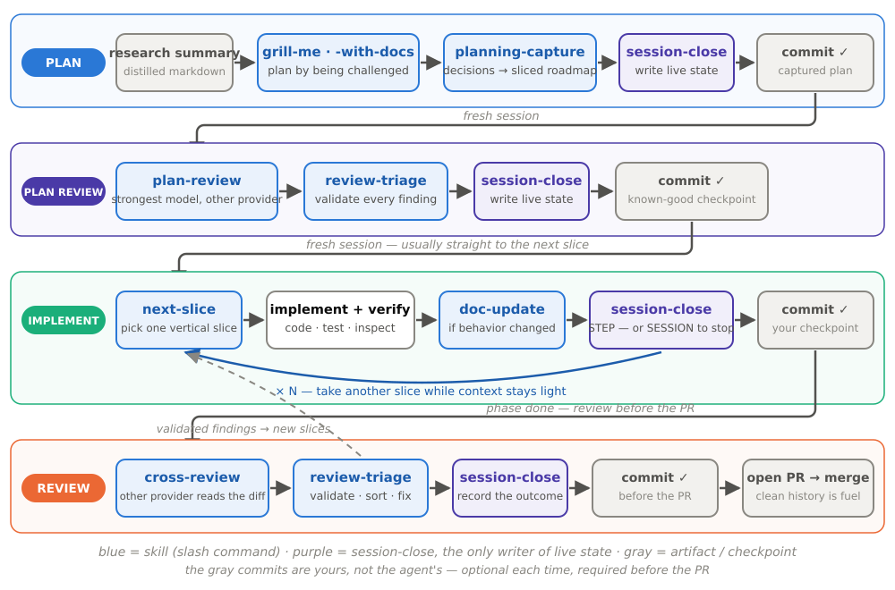

# Engineer the Workflow, Not Just the Prompt

A session-based workflow for building long-running projects with AI coding
agents — tested on **Claude Code and Codex**, refined against months of real
work.

## The problem

Vibe-coding works for a day-long task. Once a project runs longer than a
week — many sessions, several rounds of planning and implementation — two
problems dominate:

1. **The human loses track.** The agent is faster than your understanding:
   each step looks reasonable, and a week later you discover the medium-level
   decisions it quietly made. You no longer know what was built or how to
   proceed — the moment many people quit coding agents.
2. **The agent leaves its smart zone.** The reliable context zone is far
   smaller than the advertised window. Past it, the agent misses information
   already in context, confuses similar files, and spins for an hour burning
   your usage limits. Context must be managed as a budget.

Both are amplified by a third: **project knowledge has no reliable home.**
Every new session re-derives state from scratch, status is buried inside
design documents, and stale documentation gets trusted completely — the same
bug was "fixed" four times because a leftover doc kept re-teaching the buggy
behavior as intended.

None of these are model problems. They need a *defined process* — specified,
pressure-tested, and refined against real work, like any other engineering
artifact. The full analysis of all nine failure modes is in
[docs/PROBLEMS-AND-SOLUTIONS.md](docs/PROBLEMS-AND-SOLUTIONS.md).

## The idea

Work happens in three **self-contained cycles** — *plan*, *implement*,
*review* — each run when needed, each ended with `/session-close`, the standard
close-out step that synchronizes the project's live state. The next session
opens from a few small state files instead of a long transcript.

These principles carry the design:

- **Plan by being challenged.** Planning is done not when the agent understands
  the task, but when *you* can defend it. A grilling session interrogates the
  plan branch by branch before any code exists — this is how the human stays
  on track.
- **Context is a budget, not a window.** The reliable "smart zone" is an
  absolute token count — roughly 100k — no matter how large the advertised
  window is. Close sessions before the agent enters the dumb zone.
- **Agent-first documentation, fewest possible layers.** Docs exist first for
  the coding agent; well-structured, human-readable docs come almost for free
  as the second reader. Requirements say *what*, design and ADRs say *why*,
  **code says how** — the internals layer that mirrors code is deliberately
  killed. Fewer layers mean less drift and fewer tokens, and are what makes
  **one source of truth per fact** actually possible. Stale docs mislead an
  agent more than no docs, because the agent trusts them completely.
- **Status isolated from knowledge.** Current state lives in three small live
  files — `activeContext.md`, `roadmap.md`, `progress.md` — so moving work
  forward never means editing requirements or design.
- **Atomic vertical slices, written into the roadmap.** Planning breaks the
  work into small end-to-end changes — a sliver of UI + service + data,
  independently verifiable — instead of horizontal layers that only become
  testable when the UI finally appears.
- **Skills instead of repeated prompts.** The prompts you retype every session
  become named slash commands that also manage the flow — and the always-loaded
  `AGENTS.md` stays a thin router, never an encyclopedia.
- **The agent is a heavy Git user.** It reads history to orient itself, so
  small meaningful commits are context boundaries — clean history is fuel, not
  hygiene.
- **Cross-model review.** A second model from a *different provider* reviews
  both the plan and the code against the docs; the original agent validates
  each finding before anything changes. Two models agreeing is signal.

The full argument — each failure mode, why it happens, and the mechanism that
answers it, with diagrams — is in
[docs/PROBLEMS-AND-SOLUTIONS.md](docs/PROBLEMS-AND-SOLUTIONS.md). The complete
operating manual is [WORKFLOW.md](WORKFLOW.md).

## The loop



The most-used move is `/next-slice` — in practice the most reliable prompt is
literally *"find the next slice and implement it."* Take another slice while
context stays light; close the session as you approach the warn zone. The full
graph with every node's inputs, checks, and outputs is in
[WORKFLOW.md §1.1](WORKFLOW.md).

## The context budget


Long-context degradation starts well before the window is full
([Lost in the Middle](https://arxiv.org/abs/2307.03172),
[Context Rot](https://www.trychroma.com/research/context-rot)). The thresholds
are **fixed token amounts** — "12%" on a 1M-window model and "60%" on a 200k
model are the same ~120k tokens. One rule to remember: **start closing at
100k, stop coding at 120k.** An optional [Stop hook](hooks/README.md) watches
the count after every turn and nudges at the right moment — because what must
happen every time cannot depend on the model remembering.

## Quick start

```sh
./install-workflow.sh /path/to/your/project
```

Idempotent — re-run any time to reconcile. It links `AGENTS.md` (and
`CLAUDE.md` → `AGENTS.md`), wires the skills into `.agents/`, `.claude/`, and
`.codex/`, registers the context-zone hook for both tools, and scaffolds the
`docs/` tree. Flags: `-n` preview, `-f` repair links, `--with-external` pin
third-party skills per-project. Git and `jq` are prerequisites; without `jq`,
the installer leaves the Claude hook unregistered. See the
[hook dependencies](hooks/README.md#dependencies) for setup details.

Seed one unchecked step in `roadmap.md`:

```md
# Roadmap
## Phase 1 - First useful outcome
- [ ] Describe the first small result to implement.
```

Then open your coding agent and run `/next-slice` — or `/session-open` first if
you are resuming and need orientation. State files (`activeContext.md`,
`progress.md`) are created by the workflow as it runs.

## The skills

| Skill | Mode | Use it when |
| --- | --- | --- |
| `/grill-me` · `/grill-with-docs` | plan | Building the plan by being challenged, question by question. |
| `/planning-capture` | plan | Writing the agreed plan into durable docs and a vertically sliced roadmap. |
| `/plan-review` | plan review | Reviewing the captured plan as the other provider's strongest model. |
| `/next-slice` | implement | Picking the next small, verifiable vertical slice. |
| `/doc-update` | implement | Syncing durable docs to what actually changed (git diff, decision table). |
| `/cross-review` | review | Reviewing the diff since the last known-good commit against the docs. |
| `/review-triage` | review | Validating findings and sorting them by risk, effort, and value. |
| `/session-open` | any | Recovering orientation on an ambiguous resume. |
| `/session-close` | any | Ending a step (STEP) or session (SESSION) and synchronizing live state. |
| `/handoff` | any | Writing a standalone `handoff-*.md` packet for a tool or model that does not know this workflow. |

`grill-me`, `grill-with-docs`, and `handoff` are vendored from
[Matt Pocock's skills](https://github.com/mattpocock/skills) under MIT — see
[CREDITS.md](CREDITS.md).

## Project files

Status lives apart from knowledge, so moving work forward never means editing
requirements. Three small live-state files at the root — `activeContext.md`
(now + next step), `roadmap.md` (unchecked slices), `progress.md` (done) — and
durable knowledge under `docs/`: `requirements/`, `design/`, `adr/`,
`reviews/`, `research/`, `archive/` for superseded documents, plus rare
`implementation-notes.md`.

> Requirements define what must be true. Design explains why the system has
> its shape. Code defines how it works.

## Going deeper

| Read | For |
| --- | --- |
| [WORKFLOW.md](WORKFLOW.md) | The operating manual — every step, its inputs, outputs, and the workflow graph. |
| [docs/PROBLEMS-AND-SOLUTIONS.md](docs/PROBLEMS-AND-SOLUTIONS.md) | The why — nine real failure modes and the mechanism answering each. |
| [AGENTS.md](AGENTS.md) | The thin router template every project links. |
| [hooks/README.md](hooks/README.md) | Context-zone hook thresholds and setup. |

Honest limitations: the token thresholds are calibrated heuristics, not
guarantees; slice sizing still takes judgment; and the branch/PR flow is the
youngest part and will keep evolving.
