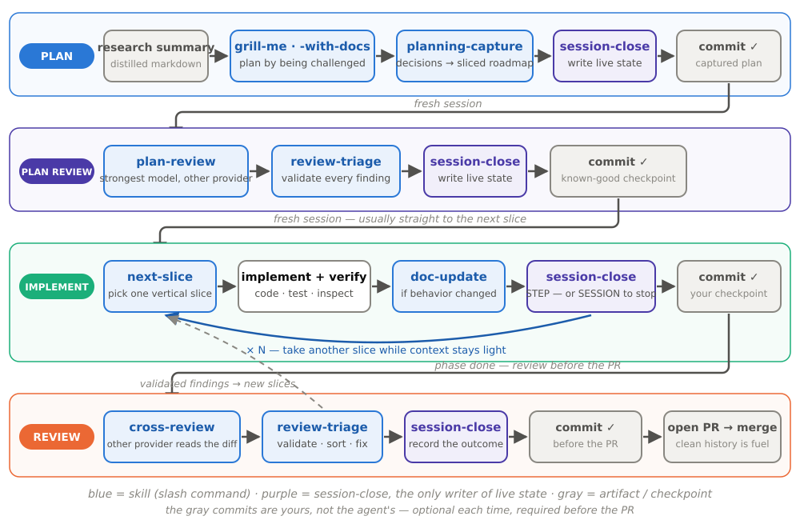
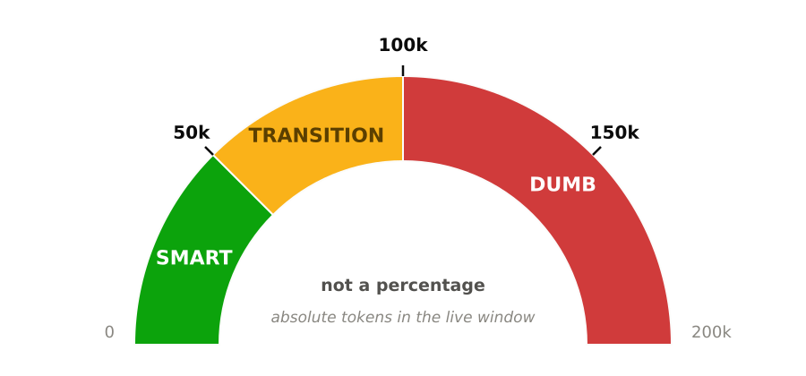

# Trackline

**Engineer the workflow, not just the prompt.**

Trackline is a session-based workflow for building long-running projects with
AI coding agents. Tested on **Claude Code and Codex**, refined against months of
real work.

## The problem

Vibe-coding works for a day-long task. Once a project runs longer than a
week — many sessions, several rounds of planning and implementation — two
problems dominate:

1. **The human loses track.** The agent is faster than your understanding:
   each step looks reasonable, and a week later you discover the medium-level
   decisions it quietly made. You no longer know what was built or how to
   proceed — the moment many people quit coding agents.
2. **The agent leaves its smart zone.** The reliable context zone is far
   smaller than the advertised window. Past it, the agent misses information
   already in context, confuses similar files, and spins for an hour burning
   your usage limits. Context must be managed as a budget.

Both are amplified by a third: **project knowledge has no reliable home.**
Every new session re-derives state from scratch, status is buried inside
design documents, and stale documentation gets trusted completely — the same
bug was "fixed" four times because a leftover doc kept re-teaching the buggy
behavior as intended.

None of these are model problems. They need a *defined process* — specified,
pressure-tested, and refined against real work, like any other engineering
artifact. The full analysis of all nine failure modes is in [WHY.md](WHY.md).

## The idea

Work happens in three **self-contained cycles** — *plan*, *implement*,
*review* — each run when needed, each ended with `/session-close`, the standard
close-out step that synchronizes the project's live state. The next session
opens from a few small state files instead of a long transcript.

These principles carry the design:

- **Plan by being challenged.** Planning is done not when the agent understands
  the task, but when *you* can defend it. A grilling session interrogates the
  plan branch by branch before any code exists — this is how the human stays
  on track.
- **Context is a budget, not a window.** The reliable "smart zone" is an
  absolute token count — roughly 100k — no matter how large the advertised
  window is. Close sessions before the agent enters the dumb zone.
- **Spec-driven development — every prompt ends up in a spec.** Nothing
  durable is allowed to die in the conversation. Planning output is written
  down by `/planning-capture`; in every other mode — implementation, plan
  review, code review — `/session-close` runs the `/doc-update` decision table
  and calls it when something durable changed. A prompt that changed the
  project but left no trace in a doc is a decision the next session cannot see.
- **Agent-first documentation.** Docs exist first for the coding agent;
  well-structured, human-readable docs come almost for free as the second
  reader. This is not a lowering of the bar — the agent is the harshest reader
  there is, because it trusts what it reads completely. A stale doc misleads it
  more than no doc at all.
- **Fewest possible documentation layers.** Every layer answers exactly one
  question, and no layer answers a question another one already owns:
  requirements say **what** must be true, design and ADRs say **why** the
  system has this shape — the intent and the reasoning behind it — and **code
  says how**. The internals layer that narrates code back in prose is
  deliberately killed: it answers *how* a second time, always one commit
  behind, and it is the layer that taught the same bug back four times. Fewer
  layers mean less drift, fewer tokens, and one obvious place to look for any
  given question.
- **One source of truth per fact.** Each fact has exactly one canonical home;
  every other document links to it instead of restating it. Two copies of a
  fact are one copy and one future lie, and nothing tells you which is which.
  Fewest layers is what makes this achievable — layers that overlap by design
  force duplication no discipline can hold back.
- **Status stays out of knowledge.** Specs state *agreed finished behavior* in
  the settled voice and read the same mid-phase or a year later. Current state,
  sequencing, and one-off implementation instructions live in the live files —
  `activeContext.md`, `roadmap.md`, `progress.md` — so moving work forward
  never means editing requirements or design. If a sentence in a spec would
  become false purely because time passed, it is status in the wrong file.
- **Atomic vertical slices, written into the roadmap.** Planning breaks the
  work into small end-to-end changes — a sliver of UI + service + data,
  independently verifiable — instead of horizontal layers that only become
  testable when the UI finally appears.
- **Skills instead of repeated prompts.** The prompts you retype every session
  become named slash commands that also manage the flow — and the always-loaded
  `AGENTS.md` stays a thin router, never an encyclopedia.
- **The agent is a heavy Git user.** It reads history to orient itself, so
  small meaningful commits are context boundaries — clean history is fuel, not
  hygiene.
- **Cross-model review.** A second model from a *different provider* reviews
  both the plan and the code against the docs; the original agent validates
  each finding before anything changes. Two models agreeing is signal.

The full argument — each failure mode, why it happens, and the mechanism that
answers it, with diagrams — is in [WHY.md](WHY.md). The complete operating
manual is [WORKFLOW.md](WORKFLOW.md).

## Quick start

Run this from the target project's Git root. Replace the source checkout path
with yours; the final `.` selects the current project:

```bash
bash /path/to/trackline/install-workflow.sh --replace-links .
```

One Bash entry automatically selects ordinary Linux links on native Linux or
WSL Linux filesystems, and Windows-native links for Windows-drive projects in
WSL. A WSL Linux-filesystem installation does not promise native Windows access.
Windows-drive source and project may be on different drives; the installer
checks native and WSL link readability before migration.

Prerequisites: **Bash, Git, Python 3, and jq**. Windows sharing additionally
requires WSL interoperability and Windows PowerShell. Native Windows Codex hooks
need Git for Windows on the Windows PATH; native Windows Claude hooks need Git
Bash with jq in that Windows Bash environment. The installer checks both and
lists what is missing under "Needs attention".

**Windows symlink privilege is mandatory for Windows-drive projects.** Enable
**Developer Mode** in Windows Settings, or launch the WSL terminal **as
Administrator**; `sudo` inside WSL does not grant Windows privileges. A dry run
does not check this. The real run probes link creation first, so a failure
such as "A required privilege is not held by the client" changes nothing: fix
the privilege and rerun the same command.

Options: `--dry-run` (`-n`) previews without writes; `--replace-links`
(`--force`, `-f`) migrates recognized Trackline links, repairs managed links left
dangling by a moved or deleted checkout, and preserves unrelated links and real
files; `--source DIR` uses another complete Trackline source; `--with-external`
also installs optional third-party skills. The installer lists every conflict
at once and changes nothing until all are resolved. Reinstalling does not
duplicate hooks or rewrite unchanged JSON. Installed router, skills, and hooks
link into the source checkout, so keep it available. The old
`install-workflow-winlinks.sh` name forwards to this same installer.

Installation keeps backups during migration and restores links/settings if a
later operation fails.

Run the installer's regression tests from this checkout with
`python3 -m unittest discover -s tests -v`. To include real native Windows link
and hook checks from WSL, set `TRACKLINE_WINDOWS_TESTS=1` first.

Seed one unchecked step in `roadmap.md`:

```md
# Roadmap
## Phase 1 - First useful outcome
- [ ] Describe the first small result to implement.
```

Then open your coding agent and run `/next-slice` — or `/session-open` first if
you are resuming and need orientation. State files (`activeContext.md`,
`progress.md`) are created by the workflow as it runs.

## The loop



The most-used move is `/next-slice` — in practice the most reliable prompt is
literally *"find the next slice and implement it."* Take another slice while
context stays light; close the session as you approach the warn zone. The full
graph with every node's inputs, checks, and outputs is in
[workflow graph](WORKFLOW.md#11-the-workflow-graph).

Commits are user-controlled checkpoints. The skills do not commit; the branch
must be committed before its PR. See [version control](WORKFLOW.md#7-version-control)
for the checkpoint and review flow.

## The context budget



Long-context degradation starts well before the window is full
([Lost in the Middle](https://arxiv.org/abs/2307.03172),
[Context Rot](https://www.trychroma.com/research/context-rot)). The thresholds
are **fixed token amounts** — "12%" on a 1M-window model and "60%" on a 200k
model are the same ~120k tokens. One rule to remember: **start closing at
100k, stop coding at 120k.** An optional [Stop hook](hooks/README.md) watches
the count after every turn and nudges at the right moment — because what must
happen every time cannot depend on the model remembering.

## The skills

| Skill | Mode | Use it when |
| --- | --- | --- |
| `/grill-me` · `/grill-with-docs` | plan | Building the plan by being challenged, question by question. |
| `/planning-capture` | plan | Writing the agreed plan into durable docs and a vertically sliced roadmap. |
| `/plan-review` | plan review | Reviewing the captured plan as the other provider's strongest model. |
| `/next-slice` | implement | Picking the next small, verifiable vertical slice. |
| `/doc-update` | implement | Syncing durable docs to what actually changed (git diff, decision table). |
| `/cross-review` | review | Reviewing the diff since the last known-good commit against the docs. |
| `/review-triage` | review | Validating findings and sorting them by risk, effort, and value. |
| `/session-open` | any | Recovering orientation on an ambiguous resume. |
| `/session-close` | any | Ending a step (STEP) or session (SESSION) and synchronizing live state. |
| `/handoff` | any | Writing a standalone `handoff-*.md` packet for a tool or model that does not know this workflow. |

`grill-me`, `grill-with-docs`, and `handoff` are vendored from
[Matt Pocock's skills](https://github.com/mattpocock/skills) under MIT — see
[CREDITS.md](CREDITS.md).

## Project files

Three root files preserve live state: `activeContext.md` names now and next,
`roadmap.md` holds scheduled slices, and `progress.md` records completed work.
Durable knowledge lives under `docs/`.

See [document roles and the installed tree](WORKFLOW.md#4-the-state-files-and-the-docs-tree)
for where each kind of fact belongs, and the
[document lifecycle](docs/document-lifecycle.md) for its producers and consumers.

Installed third-party skills also expect files such as `CONTEXT.md`. Check the
[external document contracts](WORKFLOW.md#documents-this-workflow-does-not-define)
before treating an unfamiliar file as drift.

## Going deeper

| Read | For |
| --- | --- |
| [WORKFLOW.md](WORKFLOW.md) | The operating manual — every step, its inputs, outputs, and the workflow graph. |
| [WHY.md](WHY.md) | The why — nine real failure modes and the mechanism answering each. |
| [AGENTS.md](AGENTS.md) | The thin router template every project links. |
| [hooks/README.md](hooks/README.md) | Context-zone hook thresholds and setup. |

Honest limitations: the token thresholds are calibrated heuristics, not
guarantees; slice sizing still takes judgment; and the branch/PR flow is the
youngest part and will keep evolving.
