# Why — Problems and Solutions

> Why this workflow exists: the real failure modes of long-running AI-assisted
> coding, what causes each one, and the mechanism that answers it. This is
> lived experience refined over months of real projects — numbers are personal
> operating heuristics consistent with published research, never measured
> constants. The raw documents this was distilled from are preserved in
> [docs/archive/](docs/archive/).
>
> This document is the *why*. The procedure — every step, its inputs, checks,
> and outputs — is [WORKFLOW.md](WORKFLOW.md), and each section below links
> into it rather than restating it.

**The framing that holds everything together: engineer the workflow, not just
the prompt.** After several months of AI-assisted development, most problems
were not coming from the model — they were coming from the workflow around it.
Vibe-coding works for small tasks; it does not scale to projects that run for
weeks or months. The recurring failures were context-engineering problems,
documentation problems, and orientation problems — and all three turned out to
be addressable once the workflow itself was treated as an engineering problem:
specified, pressure-tested, and refined against real work.

## The shape of the problem

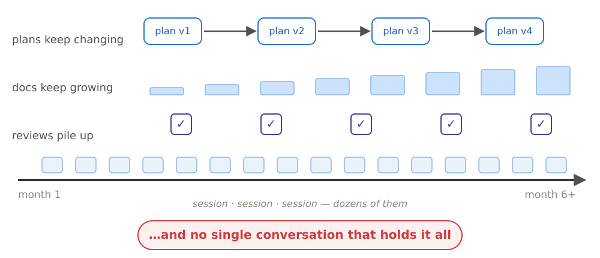

A months-long project has many sessions, changing plans, growing docs, piling
reviews — and no single conversation that holds it all. Three real stories show
what that looks like when it breaks:

**Losing track.** The agent is fast and capable — you ask, it implements, you
ask again — and after a few iterations it is much further than you. You don't
know how to proceed, because you don't understand what it has built. Some of it
is genuinely valuable and already implemented; some of it is not what you asked
for — and now you're in the worst kind of mixed state: remove the wrong parts
manually, or ask the agent to remove them and watch it introduce something else
you didn't ask for? This is the moment people quit coding agents — and it is
the first failure, before any context problem.

**Context bloat.** With a bloated context the agent spins — 20, 40, sometimes
60 minutes — not solving the problem, burning the usage limits, and a few times
outright breaking the implementation. You come back, your limits are gone, and
the code is worse.

**The bug fixed four times.** The same bug was "fixed" four times; each time
the agent re-implemented the buggy behavior as if it were the intended
functionality — even though the docs and the prompt seemed clear. The best
suspect: stale leftover documentation and no clear definition of *where* each
fact lives, *what* must be written, and *for whom*. The prompts in use at the
time — "store anything useful… capture everything into docs…" — are exactly how
documentation becomes noise.

Behind the stories, the failures sort into three families: the **agent's**
failures (missing information already in context, losing the goal, confusing
similar files, hallucinating, churning), the **process** failures
(re-explaining state every session, retyping the same prompts, docs drifting,
sessions ending with no recorded next step), and the **developer's** failure —
the human drifts too, noticing a week later the medium-level decisions the
agent quietly made.

## The problem map

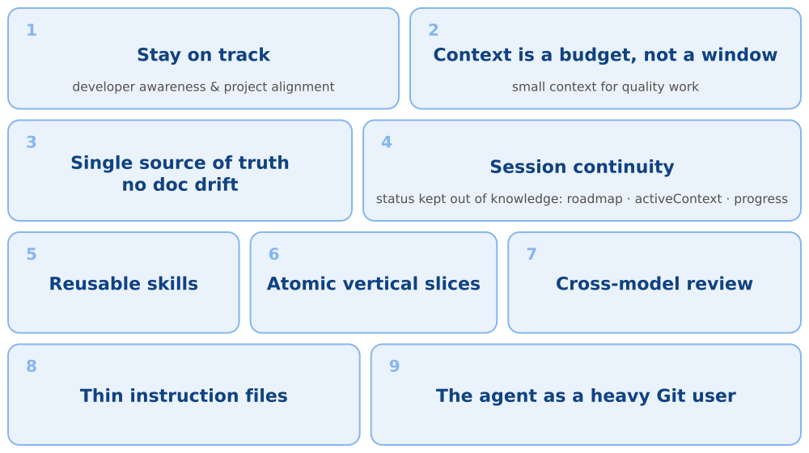

Nine problems, in the priority order the pain actually surfaced. Each section
below states the problem, why it happens, the solution, and the exact mechanism
in this repository that implements it.

## 1. Stay on track — developer awareness and project alignment

**The problem.** On a months-long build it is easy to stay busy while slowly
drifting from the original problem. The agent makes lower- and medium-level
decisions that surface a week later, by which point the direction is wrong and
the work needs restructuring.

**Why it happens.** The agent is faster than your understanding. Each
individual step looks reasonable; the drift is only visible against a plan you
can defend — and without a forced defense, weak assumptions never surface.

**The solution.** Plan by being challenged. Before any code, a grilling session
where the agent interrogates the plan branch by branch — you may answer dozens,
sometimes around a hundred structured questions, and the answers become ADRs
and project documents. *Planning is done not when the agent understands the
task, but when you can defend it.* Keep alignment in an always-current
roadmap / progress / activeContext trio, and enforce mode discipline so both
sides always know whether the work is research, planning, plan review,
implementation, or code review.

**In this workflow.** [`/grill-me`](skills/grill-me/SKILL.md) and
[`/grill-with-docs`](skills/grill-with-docs/SKILL.md) run the interrogation
(the `-with-docs` variant additionally challenges the plan against the
project's existing documents and domain language);
[`/planning-capture`](skills/planning-capture/SKILL.md) — the most
human-in-the-loop step of the whole workflow, which is exactly why the
strongest available model belongs here — distributes the results into
requirements, design, ADRs, roadmap, and active context. Planning consumes few
tokens compared to implementation but has the highest leverage.

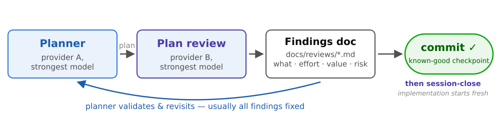

Before implementation starts, [`/plan-review`](skills/plan-review/SKILL.md)
has the *other provider's* strongest model review the captured plan — the same
findings loop as code review, one stage earlier and far cheaper: a flaw caught
in the plan costs an edit; caught in code it costs a re-implementation. Then
commit: the reviewed plan is a known-good checkpoint, and implementation opens
in a fresh session, never in the planning one.

## 2. Context is a budget, not a window

**The problem.** A bigger context window can make the agent *dumber* in
practice. Modern models advertise huge windows, but the reliable "smart zone"
is much smaller. Past it, the agent misses information already in context,
loses the goal, confuses similar files, hallucinates, makes unnecessary
changes, and spins for 20–60 minutes without solving the problem.

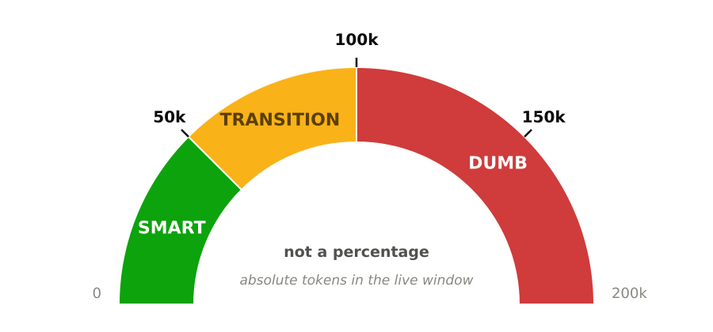

**Why it happens.** Degradation starts well before the window is full — *Lost
in the Middle* (Liu et al.) shows retrieval depends on position; *Context Rot*
(Chroma Research) shows quality decays as context grows. The reliable zone sits
comfortably under ~50k tokens for most models, many keep working well to
~75–100k, and quality is clearly worse above ~100–150k. These are two
thresholds with a model-dependent transition band, not one cliff — and they are
**absolute token counts, not fractions of the advertised window**. A 1M-token
window does not move the cliff; it just makes the same cliff look like a
smaller percentage.

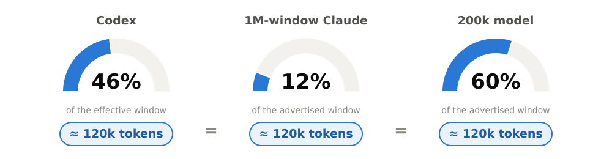

The same token count therefore reads as a different percentage on every product
surface, which is why a status-line percentage is a readout and never a target.
On a 1M-window model this workflow closes sessions at around a tenth of the
advertised capacity — wasteful on paper, reliably smarter in practice. The
exact thresholds live in [WORKFLOW.md §6](WORKFLOW.md).

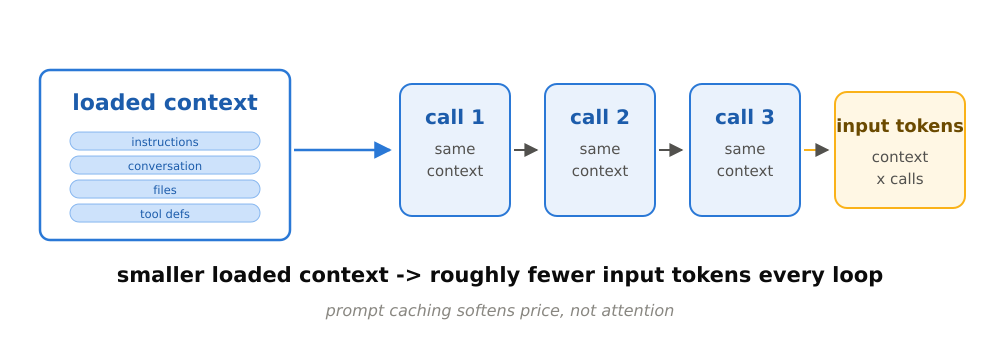

There is also a mechanical cost: on every iteration of the agentic loop the
entire context is re-sent to the model, so input-token consumption scales
roughly *linearly* with loaded context, multiplied across every loop iteration.
Prompt caching softens the price — cached prefix tokens bill at roughly a tenth
of the base input price — but the model still *attends* to every loaded token
on every call. That is why lean context is a **quality lever first and a cost
lever second**.

**The solution.** Treat context as a budget: a fixed number of tokens to spend
per session, with the close scheduled before quality drops rather than after
you notice that it has.

**In this workflow.** The [context-zone hook](hooks/README.md) watches token
usage after every turn and nudges at those fixed amounts, whatever the active
model's window — because what must happen every time cannot depend on the model
remembering:

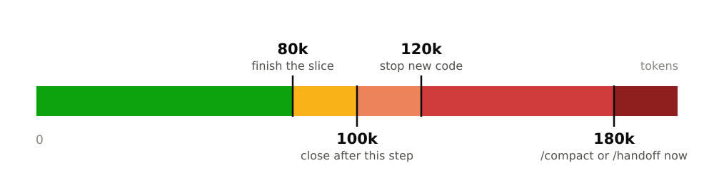

## 3. Documentation with one source of truth

**The problem.** Three spec layers — requirements (what), design (why),
internals (how the code works) — and the internals layer quietly rotted. After
enough planning-to-implementation round-trips the code moved on and the
document did not, becoming a second source of truth that disagreed with the
code. With agents this is worse than with humans, because **the agent trusts
the stale document completely** (see "the bug fixed four times" above). Stale
docs are worse than no docs.

**Why it happens.** The layer closest to code changes most often and is exactly
the layer code-reading can reconstruct cheapest. Every doc layer you maintain
is a liability proportional to how often it changes — and "store everything
useful" prompts turn documentation into noise.

**The solution.** The documentation system was designed around explicit
criteria — the very first step of this workflow was not writing skills but
researching what to write down at all:

1. **The coding agent is the first reader.** Documentation exists first to give
   the agent clear implementation instructions; human understanding is the
   second priority — and in practice agent-first docs come out well-structured
   and human-readable almost for free.
2. **Single source of truth.** One canonical home per fact. Reference, don't
   copy — the same information must never live in two places.
3. **Prevent drift and staleness** — stale docs mislead the agent more than no
   docs, because the agent trusts them completely.
4. **Fewest tokens for the same decision quality.** What is the smallest amount
   we can write and keep the work quality? Writing a fact twice costs double
   every time it is loaded.
5. **The always-loaded router gets the strictest budget.** `AGENTS.md` /
   `CLAUDE.md` is loaded every session, so every line must earn its keep.

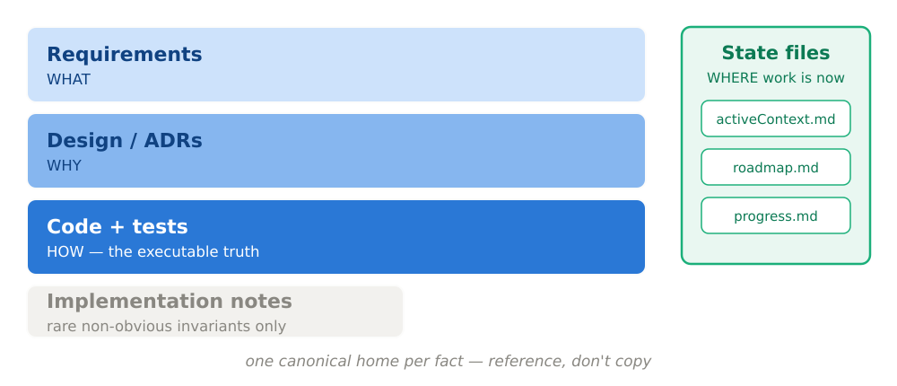

Applying the criteria killed the third layer: requirements = *what*;
design/ADRs = *why*; **code and tests = the executable truth for *how***;
implementation notes hold only rare non-obvious invariants; state files say
*where work is now*. The deletion test for everything else: *would removing
this make a future session decide worse?* If not, delete it.

**In this workflow.** The docs tree (`docs/requirements/`, `docs/design/`,
`docs/adr/`, `docs/implementation-notes.md`) with
[`/doc-update`](skills/doc-update/SKILL.md) as the sync mechanism and
[`/session-close`](skills/session-close/SKILL.md) as the safety net that
re-checks the doc-update decision once per close.

## 4. Session continuity — externalized state, status separate from knowledge

**The problem.** Every new session re-derived the project state from scratch:
the same files loaded, reasoned over, discarded, then paid for again next time
in tokens and quality. Session end is unpredictable — context creeps upward and
you rarely know which step is the last — so handoff timing could never be
planned. And when status lived inside requirements or design documents, moving
work forward meant editing four documents.

**The solution.** Externalize state into a few small live-state files, and keep
status *out* of the knowledge documents entirely, so a session boundary becomes
*a deliberate reset with durable continuity, not a loss of project knowledge*.
Two cautions from practice: save and restore also cost tokens, so the state
files must stay small; and the close must be cheap and routine, or an
unpredictable session end will make you skip it and lose the thread.

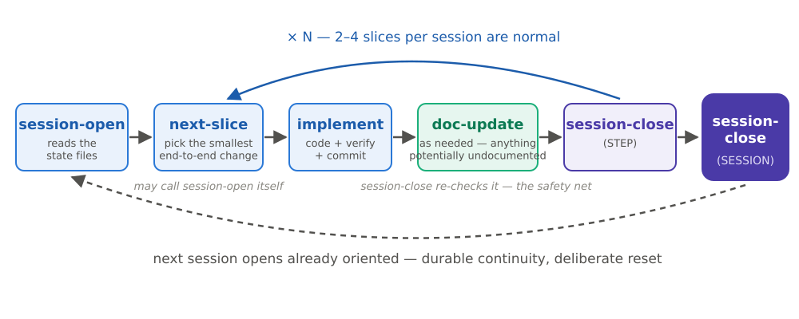

**In this workflow.** [`/session-close`](skills/session-close/SKILL.md) is the
only writer of the state files and [`/session-open`](skills/session-open/SKILL.md)
opens the next session already oriented — the file-by-file contract is
[WORKFLOW.md §4](WORKFLOW.md). The close also records blockers, open questions,
and **discarded dead ends** — the most commonly omitted part of a handoff, and
one of the most valuable, because the next session never re-litigates a path
that already failed.

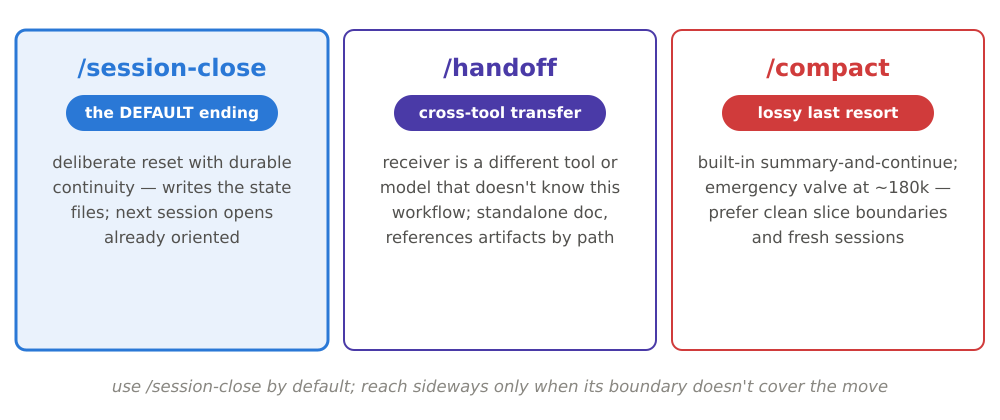

When context climbs, there are three exits, and the choice is directional, not
neutral: **`/session-close` is the normal answer** — preserve durable state and
reopen fresh. **`/handoff` is for interruption** — you cannot finish the
session properly, so you write standalone continuation state for another tool,
model, or session. **`/compact` is the fallback of last resort** — with this
workflow, compaction is basically not needed, because sessions close before the
context ever gets that far.

## 5. Reusable skills instead of repeated prompts

**The problem.** Retyping the same long prompts every session, slightly
differently each time: "update the docs, be concise but complete, check
consistency…", "write a handoff: what was done, what's next, key files,
risks…". Temporary prompts scattered in project files were not a workflow.

**The solution.** Move the repeated prompts into named skills that also *manage
the flow* — what comes first, what's next, how a session properly ends. Skills
are not macros; they are the workflow's guidance system, and they enforce
**mode discipline**: at any moment the work is in exactly one stage.

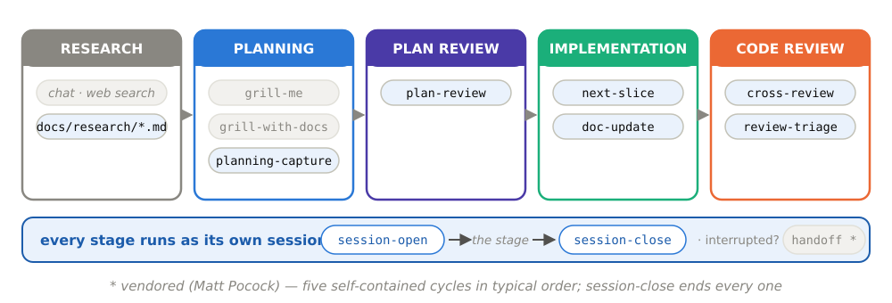

**In this workflow.** Five stages in typical order — **research · planning ·
plan review · implementation · code review** — run inside the three
self-contained cycles (plan, implement, review), each cycle opened by
`/session-open` when orientation is needed and ended by `/session-close`
(or `/handoff` if interrupted). Research has no skill of its own: chat and web
exploration are distilled into `docs/research/*.md`, and raw research never
enters an implementation session.

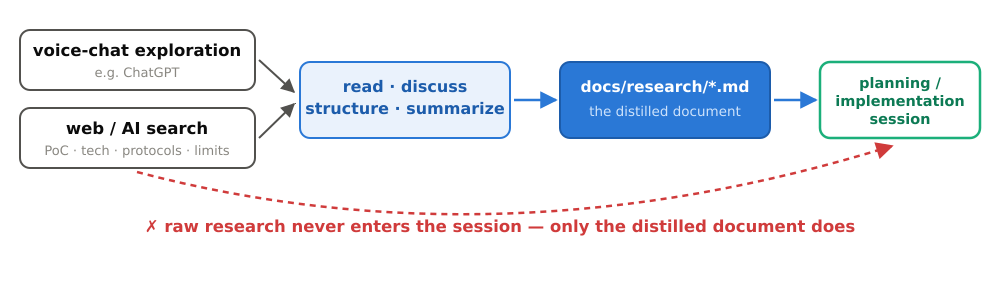

Planning holds `grill-me` /
`grill-with-docs` / `planning-capture`; plan review holds `plan-review`;
implementation holds `next-slice` and `doc-update` (called whenever something
potentially undocumented was asked or found — during the slice, not only at the
end); code review holds `cross-review` and `review-triage`.

## 6. Atomic vertical slices

**The problem.** Left alone, coding agents plan bottom-up in horizontal
layers — database → infrastructure → API → UI — and real testing only becomes
convenient once the UI finally appears: hours, days, and a great many tokens
before a testable version exists. Large changes are also hard to review, and
they force the agent to hold too much of the project in working memory at once.

**The solution.** One small end-to-end change at a time — a sliver of UI +
service + data, not a whole layer: the smallest slice that has meaning and
delivers complete functionality, each **independently verifiable** by a test, a
manual check, or an inspectable diff. Small enough to keep context lean, big
enough to justify the open/close overhead — save and restore also cost tokens,
so the economics must be honest. The lived numbers: implementing one slice
typically moves context from ~10–15% to ~20–30% (200k-era readout), very rarely
toward 40% — which is why two, three, even four slices per session are normal.

**In this workflow.** [`/next-slice`](skills/next-slice/SKILL.md) chooses
the slice; the loop is `next-slice → implement and verify →
session-close (STEP)`, repeated until context approaches the Warn Zone, with a
commit whenever the state reached is one worth returning to (§9).

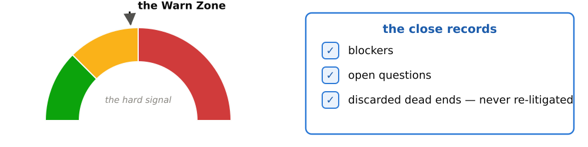

When to close is a feel plus a hard signal: if the next slice is clearly
different territory, close first; the Warn Zone (~100k tokens) is the signal
to respect regardless.

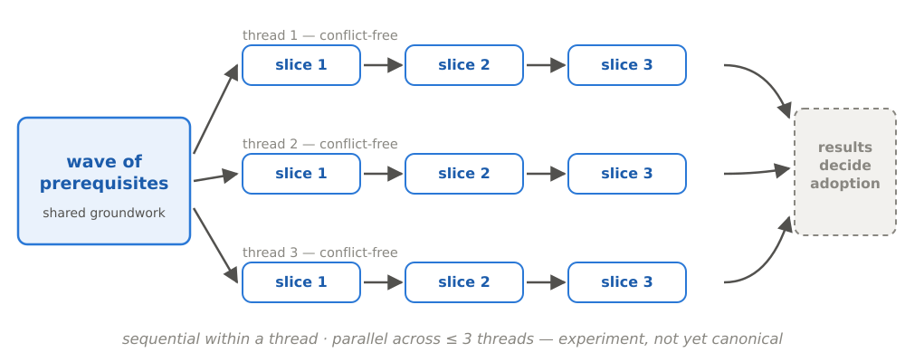

The newest experiment — not yet canonical — extends the discipline: plan a
first wave of prerequisites, then up to three independent, conflict-free
threads of slices. Sequential within each thread, parallel across threads, no
dependencies or conflicts between them.

## 7. Cross-model code review

**The problem.** The implementing model cannot see everything about its own
work — and a structured way was needed to review it (and to use leftover
usage-window budget productively).

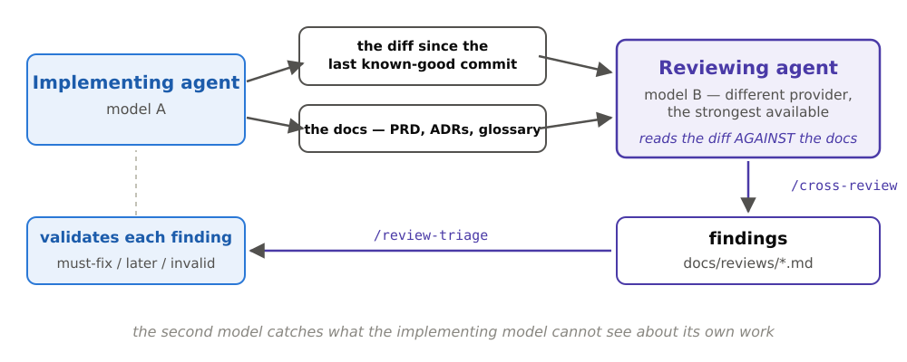

**The solution.** A second, stronger, always *different-provider* model (Claude
reviews Codex output, or vice versa) reads the diff since the last known-good
commit **against the documentation** — hunting misimplementation, missing
implementation, bugs, gaps, incorrect logic, and what could be done better —
and writes findings to a Markdown file. The original agent then validates each
finding against the actual code before anything changes: in practice roughly
70–80% of findings are worth implementing. Each finding gets **what · effort ·
value · risk** columns — the same evaluation habit as plan review: one habit,
two targets — and is triaged into must-fix-now, before-phase-complete, backlog, or
invalid. Two independent models usually agree on the important findings, and
that agreement is signal. The review discussion itself is disposable; only
validated findings and the resulting changes are kept.

**In this workflow.** [`/cross-review`](skills/cross-review/SKILL.md) on the
reviewer side writes findings to `docs/reviews/`;
[`/review-triage`](skills/review-triage/SKILL.md) on the original agent's
side validates and sorts them; accepted findings fold into `roadmap.md` and get
implemented as ordinary slices.

## 8. Thin instruction files, exact names

**The problem.** `AGENTS.md` / `CLAUDE.md` are loaded into every session, so
every line is comparatively expensive. They grow line by line — the agent
appends a note, you add a rule — until the file is a half-stale encyclopedia.
Vague requests ("the settings page") make the agent guess and quietly bake
wrong context into the diff.

**The solution.** Keep the instruction file a thin router: short, specific,
verifiable rules plus routing pointers to skills and docs — **instructions and
routing, never information**. Any section that has grown into a procedure moves
out to a skill, whose body loads only on demand. The test before adding any
line: could this live in a skill with the same decision quality? If yes, move
it. In prompts, use exact names — file, function, page, widget, path — so the
agent fetches the right context itself; that is what lets the context stay
thin. For small focused tasks a minimal or even absent instruction file often
works better; this workflow's [`AGENTS.md`](AGENTS.md) is the deliberate
exception because it is load-bearing — it declares the mode, names the next
step, and points at the docs.

## 9. The AI agent is a heavy Git user

**The problem.** Coding agents rely on version-control state, and it is easy to
miss how. When asked to review, an agent often compares only the uncommitted
diff against the last commit — you think it reviewed everything while it
reviewed one slice. A messy history of "wip" and "fix" also removes a signal
the agent actively uses to orient itself.

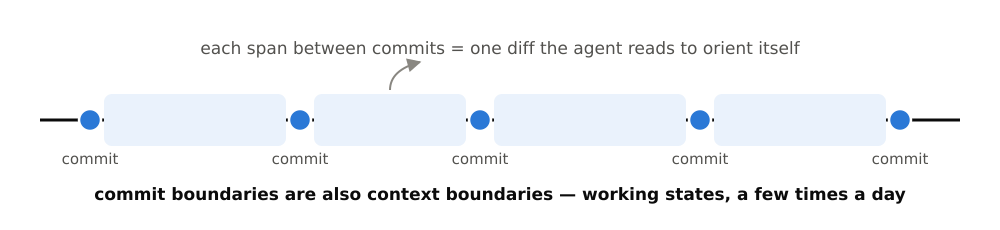

**The solution.** The agent reads history — `git log`, `git diff`,
`git blame` — to understand what changed and why: conversation provides
reasoning, project files preserve decisions, and Git preserves change. Commit
working states a few times a day, with one agent-aware consideration on top of
the usual criteria: the agent reads diffs to make assumptions and load context,
so **commit boundaries are also context boundaries**.

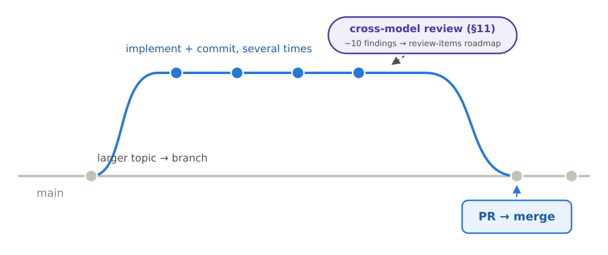

**In this workflow.** Every cycle ends with a commit stage, and the code
review's "diff since the last known-good commit" scope stands entirely on that
discipline. But the commits are the one part of the workflow no skill performs:
each stage is a checkpoint you take, batch, or skip, and only the one before
the PR is binding. The branch and pull-request flow as practiced is
[WORKFLOW.md §7](WORKFLOW.md).

## Not solved — and the automation that guards the discipline

Honesty about what remains open: the token thresholds are calibrated
heuristics, not guarantees; slice sizing still requires judgment per project
and model; and the branch/PR/review flow is the youngest part and will keep
evolving. For a while the practiced flow ran *ahead of its own
documentation* — a documentation-drift confession from the workflow that
preaches against drift — reconciled in July 2026, the same day the practiced
but skill-less review steps became `/plan-review` and `/cross-review`.

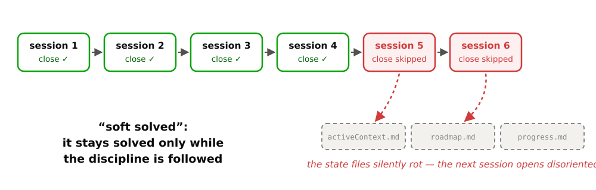

Several problems are only **"soft solved"**: they stay solved only while the
discipline is followed. Skip session-close twice and the state files silently
rot — the next session opens disoriented. Therefore automation must guard the
discipline: instructions and skills are suggestions the model may or may not
follow; **hooks always run** — the only layer of the customization surface with
a guarantee.

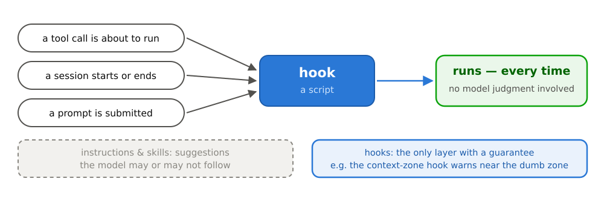

The [context-zone hook](hooks/README.md) warns as the session approaches the
dumb zone; `/session-close` is the single choke-point that writes state; the
idempotent [installer](install-workflow.sh) wires skills and hooks so a
project cannot be half-configured — the same skills and the same single hook
script run on both Claude Code and Codex, one canonical copy symlinked
everywhere, no per-tool forks.

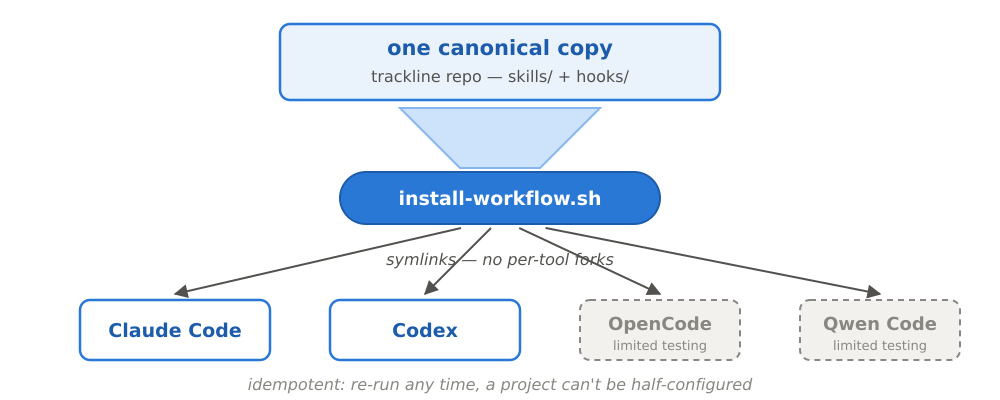

*What must happen every time cannot depend on the model remembering.*

## Where this document came from

This is the distilled, current form of material that accumulated over months:
the original pain-point record, raw workflow-design conversations, and
supplementary notes are preserved verbatim in [archive/](docs/archive/). The
operating manual — every step in detail — is
[WORKFLOW.md](WORKFLOW.md).
