# Workflow — Operating Manual

> This is the full operating manual for the workflow: the step-by-step model the
> [README](README.md) summarizes. The README tells you *what* the workflow is and
> how to install it; this document tells you *how to run it* — every step, what it
> does, what problem it solves, what comes before it, what comes after it, and the
> side-steps that interleave with the common path.
>
> Read the README first. Read this when you want the complete operating model or
> want to change the workflow itself. The rationale behind each problem lives in
> [docs/PROBLEMS-AND-SOLUTIONS.md](docs/PROBLEMS-AND-SOLUTIONS.md); this document is the procedure.

---

## 1. The generic flow

The workflow is not one long pipeline. It is a small set of **self-contained
cycles** — *plan* (with its own cross-model review as a second session),
*implement*, and *review* — each opened with `/session-open`
when orientation is needed and ended with `/session-close`. You close the plan;
later you open and close implementation; later you open and close a review. They
are separate units of work, run when each is needed, not stages of a single run.

```text
PLAN  (often starts off the coding agent — see §3.1)
  research / discussion → gather into a Markdown summary
    → /grill-me  or  /grill-with-docs    plan by being challenged
    → /planning-capture                  break the work into vertical slices → requirements / design / ADR / sliced roadmap
    → /session-close                     record the next step, end the planning session
    → commit                             the captured plan is a good checkpoint (often a separate, lighter-model session)

PLAN REVIEW  (its own session — the other provider's strongest model; see §3.4)
    → /plan-review                       reviewer cross-validates the captured docs → findings file
    → /review-triage                     planner validates each finding, revisits the plan
    → /session-close                     end the plan-review cycle
    → commit                             the reviewed plan is a known-good checkpoint; implementation opens fresh

IMPLEMENT  (repeat per slice)
    → /next-slice                        "find the next slice and implement it"
    → implement and verify
    → /doc-update                        as needed — only when the slice changed durable behavior
    → /session-close                     STEP to continue with another slice, SESSION to stop
    → commit                             your checkpoint — take it when the state is worth returning to
  ↺ take another slice while context stays light; end the session as you near the Warn Zone (§6)

REVIEW  (its own step — run after a slice or phase, often in a separate session)
    → /cross-review                      the other provider's strongest model reads the diff → findings file
    → /review-triage                     validate, sort, fix only must-fix-now
    → /session-close                     record the outcome
    → commit                             the one commit you cannot skip — the branch must be clean before the PR
```

Every cycle ends with `/session-close` — the only step that writes the live state
files (`roadmap.md`, `progress.md`, `activeContext.md`), which is why it is never
optional. `/handoff` is a separate option for moving work to a *different* tool or
model; it is not a stage in this flow.

The `commit` closing each cycle is the opposite kind of step: no skill runs it
and nothing enforces it. Checkpoint when the state is worth returning to, batch
several slices into one, or skip it. Only the last one is binding — committing
the branch properly before the PR is your job, not the agent's (§7).

The most-used move is `/next-slice`; in practice the most reliable prompt is
literally *"please find the next slice and then implement it."* Everything below
expands these cycles.

### 1.1 The workflow graph

The same flow as a graph: nodes are skills (each labeled with its § below),
diamonds are decisions, edge labels are the conditions that move work between
nodes. The per-node contracts — inputs, checks, outputs — follow in the table,
because a graph stays readable only when nodes stay small.

The four `commit` nodes are the only ones you perform yourself — no skill
commits (§7). Skip one and the flow still runs; the cost is a coarser diff for
the next review or resume. Only the commit before the PR is mandatory.

```mermaid
flowchart TD
    classDef skill fill:#eaf2fc,stroke:#2a78d6,color:#1c5cab
    classDef artifact fill:#f2f1ee,stroke:#898781,color:#52514e
    classDef decision fill:#fff7e6,stroke:#d08b1d,color:#8a5a00
    classDef guard fill:#fdeaea,stroke:#d03b3b,color:#8f2323

    START(["new idea / feature / phase<br/>too big to code directly"]):::artifact

    subgraph PLAN["PLAN — planner session, strongest available model"]
        RS[/"research summaries<br/>docs/research/*.md (§3.1)"/]:::artifact
        GR["/grill-me · /grill-with-docs (§3.2)<br/>plan by being challenged<br/>-with-docs updates: CONTEXT.md · docs/adr/"]:::skill
        PC["/planning-capture (§3.3)<br/>breaks the work into vertical slices<br/>writes: docs/requirements/ · docs/design/ ·<br/>docs/adr/ · roadmap.md"]:::skill
        SC1["/session-close SESSION (§3.10)<br/>writes: activeContext.md · roadmap.md · progress.md"]:::skill
        C1(["commit — captured plan<br/>(often a separate, lighter-model session)"]):::artifact
    end

    subgraph PREV["PLAN REVIEW — other provider's strongest model, own session"]
        PR["/plan-review (§3.4)<br/>cross-validates req ↔ design ↔ ADR ↔ roadmap<br/>writes: docs/reviews/*.md"]:::skill
        RT1["/review-triage (§3.9)<br/>planner validates each finding<br/>updates: the plan docs per accepted finding"]:::skill
        SC2["/session-close SESSION<br/>writes: activeContext.md · roadmap.md · progress.md"]:::skill
        C2(["commit — reviewed plan,<br/>known-good checkpoint"]):::artifact
    end

    subgraph IMPL["IMPLEMENT — fresh session, repeat per slice"]
        SO["optional: /session-open (§3.5)<br/>ambiguous resume only — usually skipped<br/>reads: activeContext.md · roadmap.md"]:::skill
        NS["/next-slice (§3.6)<br/>picks one atomic slice from roadmap.md<br/>cross-checks: activeContext.md · git state ·<br/>the relevant code"]:::skill
        IV["implement + verify (§3.7)<br/>writes: code + tests<br/>(only activeContext.md may move inline)"]
        DQ{"durable behavior<br/>changed?"}:::decision
        DU["/doc-update (§3.8)<br/>updates: docs/requirements/ · docs/design/ ·<br/>docs/adr/ · docs/implementation-notes.md"]:::skill
        SCS["/session-close STEP<br/>ticks roadmap.md · appends progress.md ·<br/>refreshes activeContext.md"]:::skill
        ZQ{"context light AND<br/>same territory?"}:::decision
        SC3["/session-close SESSION<br/>writes: activeContext.md · roadmap.md · progress.md"]:::skill
        C3(["commit — your checkpoint<br/>(you decide; also fine per slice at SCS)"]):::artifact
    end

    subgraph REV["REVIEW — other provider's strongest model"]
        CR["/cross-review (§3.9)<br/>diff since known-good commit, read against docs<br/>writes: docs/reviews/*.md"]:::skill
        RT2["/review-triage (§3.9)<br/>implementer validates findings<br/>folds accepted ones into roadmap.md"]:::skill
        SC4["/session-close SESSION<br/>writes: activeContext.md · roadmap.md · progress.md"]:::skill
        C4(["commit — before the PR<br/>(the one commit you cannot skip)"]):::artifact
    end

    MERGE(["open PR → merge (§7)"]):::artifact
    HOOK["context-zone hook (§8)<br/>fires after every turn"]:::guard
    HAND["/handoff (§3.11)<br/>writes: handoff-*.md — standalone packet<br/>for another tool/model"]:::skill

    START --> RS --> GR
    GR -- "plan defensible" --> PC
    PC --> SC1 --> C1
    C1 -- "fresh session" --> PR
    PR -- "findings file" --> RT1
    RT1 -- "plan revised" --> SC2 --> C2
    C2 -- "fresh session —<br/>usually straight to" --> NS
    SO -. "when disoriented" .-> NS
    NS -- "you confirm the slice" --> IV
    IV --> DQ
    DQ -- "yes" --> DU --> SCS
    DQ -- "no" --> SCS
    SCS --> ZQ
    ZQ -- "yes — take<br/>another slice" --> NS
    ZQ -- "no — Warn Zone ~100k<br/>or different territory" --> SC3
    SC3 --> C3
    SCS -. "worth saving —<br/>your call" .-> C3
    C3 -- "phase done /<br/>before PR" --> CR
    C3 -- "work remains —<br/>next session" --> NS
    CR -- "findings file" --> RT2
    RT2 -- "accepted findings →<br/>roadmap.md review items" --> NS
    RT2 --> SC4
    SC4 -- "all must-fix-now done" --> C4
    C4 --> MERGE
    HOOK -. "nudges at 80k / 100k / 120k" .-> ZQ
    IV -. "interrupted — cannot<br/>close properly" .-> HAND
```



### 1.2 Node contracts

What each node consumes, checks, and produces, and what moves the work on.
Full detail lives in the § each row points to — this table is the index, not a
second copy.

| Node | Session / model | Inputs | Checks / decides | Output | Moves on — when |
|---|---|---|---|---|---|
| Research (§3.1) | often off the coding agent | idea, transcripts, inherited docs | too big to code directly? | `docs/research/*.md` summaries | grilling — when the summary is ready |
| `/grill-me` · `/grill-with-docs` (§3.2) | planner, strongest model | research summaries, selected project files, a large prompt | can you defend every branch? is the work sliced vertically? | agreed decisions (`-with-docs`: glossary + inline ADRs) | `/planning-capture` — when the plan is defensible |
| `/planning-capture` (§3.3) | same planning session | grilling output | one home per fact; breaks the work into vertical slices; AFK/HITL per slice | `docs/requirements\|design\|adr/`, vertically sliced `roadmap.md` | `/session-close`, then commit — always |
| `/plan-review` (§3.4) | other provider's strongest model, own session | the captured docs | gaps, contradictions, wrong assumptions, terminology drift | findings table (effort/risk/value) in `docs/reviews/` | `/review-triage` — always |
| `/review-triage` on the plan (§3.4, §3.9) | planner | findings file + the docs | validate / clarify / justify each finding | revised plan docs | `/session-close`, then commit; implementation opens fresh |
| `/session-open` (§3.5) | optional — ambiguous resume only, usually skipped | `activeContext.md`, `roadmap.md` (handoff only if unclear) | which mode? what single next action? | declared mode + named next action | that action — usually `/next-slice`; skipped for direct tasks |
| `/next-slice` (§3.6) | implementer | `activeContext.md`, `roadmap.md`, recent git state, the relevant code | smallest meaningful, dependency-free, verifiable slice | one proposed slice | implement — after your confirmation |
| implement + verify (§3.7) | implementer | the confirmed slice | test / manual check / inspectable diff passes | working, verified change | `/doc-update` if durable behavior changed; else `/session-close (STEP)` |
| `/doc-update` (§3.8) | implementer | git diff of the change | decision table: which durable doc did this touch? | updated docs — or "nothing durable changed" | `/session-close` |
| `/session-close` STEP (§3.10) | implementer | the finished step | step really finished? scope changed → `/doc-update` first | ticked `roadmap.md`, dated `progress.md`, refreshed `activeContext.md` | `/next-slice` — context light and same territory; SESSION close otherwise |
| `/session-close` SESSION (§3.10) | any cycle | session state | doc-update table once; blockers, open questions, dead ends | state files (+ `handoff-*.md` only if needed) | next session's `/session-open` |
| commit (§7) | you — never the agent | the closed step or session | is this a state worth returning to? | a checkpoint in history, and a review scope for `/cross-review` | next slice / review / PR — optional each time, required before the PR |
| `/cross-review` (§3.9) | other provider's strongest model | diff since last known-good commit + the docs | misimplementation, gaps, bugs, better options | findings file in `docs/reviews/` | `/review-triage` — always |
| `/review-triage` on code (§3.9) | implementer | findings + the actual code | validate each; sort must-fix-now / before-phase / backlog / invalid | review items folded into `roadmap.md` | `/next-slice` for fixes; PR when clean |
| `/handoff` (§3.11) | any cycle, interrupted | the live conversation | receiver does not know this workflow? | standalone, pointer-based handoff doc | the other tool's session |
| context-zone hook (§8) | guard — after every turn | transcript token count | fixed 80k / 100k / 120k / 180k thresholds | `systemMessage` nudge | escalates toward `/session-close (SESSION)` |

## 2. Operating principles

Five ideas justify the steps. They are summarized here and argued in full in
[docs/PROBLEMS-AND-SOLUTIONS.md](docs/PROBLEMS-AND-SOLUTIONS.md) and the README's Goals.

- **Engineer the workflow, not just the prompt.** The workflow is a specified,
  pressure-tested artifact, refined against real work — it matters more than the
  model.
- **Context is a budget, not a window.** The reliable **smart zone** is an
  absolute token count, not a fraction of the advertised window; past it lies
  the **dumb zone**, where the agent misses information already in context,
  confuses files, and spins. Avoiding the dumb zone is the reason the
  session-close / session-open loop exists at all. Context size is also a
  token-usage multiplier: every iteration of the agentic loop re-sends the
  loaded context, so a lean context is cheaper as well as smarter — while a few
  slices that share the same context can still run in one session. See §6 for
  the thresholds.
- **Code is the truth; one canonical home per fact.** Re-derive *how* from the
  code. Never write an internals spec that mirrors code, and never duplicate a
  fact across docs. Apply the deletion test: if removing a line would not make a
  future session decide worse, delete it.
- **Mode discipline.** At any moment the work is in exactly one mode — planning,
  implementing, reviewing, or closing — and each skill belongs to one mode.
- **Atomic vertical slices.** Implement one small, end-to-end, independently
  verifiable change at a time, so the agent never needs the whole project in
  working memory.

## 3. The steps in detail

Each step below follows the same shape: **what it does**, **what it solves**,
**comes after**, **comes before**, and how it is invoked. The skills appear in
the order a project uses them.

### 3.1 Research (pre-step — often off the coding agent)

**What it does.** Gathers the raw thinking a plan needs: exploratory discussion,
tradeoff clarification, deep research. This frequently happens *outside* the
coding agent — a conversation in ChatGPT, often on the phone during normal daily
activity, sometimes several minutes of dictated context. Several iterations are
normal — a voice chat in transport, another at home, a desk session with the
coding agent itself — and each iteration is captured as its own Markdown file
under `docs/research/`. Relevant pre-existing material (docs inherited from
older projects, manually collected references) is placed alongside those files,
so the grilling step that follows can be fed the whole set.

**What it solves.** Keeps large, noisy exploration out of the coding session,
where it would burn context budget. The input itself varies in size — sometimes a
short prompt, but frequently large documents, files, or transcripts you do not
want to read in full. The deliverable is a compact **Markdown summary** that
distills them, not the raw material — the summary is the bridge into coding
context, and the grilling and capture steps below are what turn that bulk into
something you and the agent do not have to re-read.

**Comes after.** A new idea, feature, or phase that is too big to start coding
directly.

**Comes before.** A grilling session (`/grill-me` or `/grill-with-docs`), which
takes that summary as input.

> Dictation note: when the input is spoken, an offline speech-to-text tool such as
> [Handy](https://github.com/cjpais/handy) (Whisper Large for higher accuracy)
> turns it into text before it becomes the Markdown summary. The tool is
> incidental; the point is that planning input is distilled to Markdown before
> coding starts.

### 3.2 `/grill-me` and `/grill-with-docs` — plan by being challenged

**What they do.** This *is* the planning session — the plan is built by being
challenged, not stress-tested after the fact. The agent interviews you
relentlessly, one question at a time, walking down each branch of the design
tree until weak assumptions surface and the plan takes shape.
You begin the session with several input documents (the research summary, selected
project files) and usually a large typed or dictated prompt.

- `/grill-me` — pure plan interrogation.
- `/grill-with-docs` — additionally challenges the plan against the project's
  existing domain language, sharpens fuzzy terms, and updates a glossary
  (`CONTEXT.md`) and ADRs inline as decisions crystallize.

**What they solve.** Planning is not done when the agent understands the task —
it is done when you can defend the task and its boundaries. Grilling is how you
get there, and how you stay aware of and aligned with what the agent will build.
A good grilling session also surfaces the boundaries that let the work be cut
**vertically** — the actual breaking into thin vertical slices happens in
`/planning-capture` (§3.3), which shapes `roadmap.md` that way — so output is
visible sooner and problems surface in the early stages instead of at the end.
This matters because, left alone, coding agents tend to plan bottom-up in horizontal
layers — database, then infrastructure, then API, then UI — and real testing
only becomes convenient once the UI finally appears, hours or days (and a great
many tokens) after work started. A vertical slice is the antidote: the smallest
piece of complete, meaningful functionality, crossing every layer of the stack
from infrastructure or database through the middle layers to UI/UX.

**Comes after.** Research gathered into a Markdown summary (§3.1).

**Comes before.** `/planning-capture`, which writes the agreed decisions into
durable docs.

> Both skills are vendored from Matt Pocock's public agent-skills repo under the
> MIT License so they travel with the workflow. See `CREDITS.md`.

### 3.3 `/planning-capture` — write the plan into durable docs

**What it does.** Takes the planning output and classifies each non-trivial point
into exactly one home: a **requirement**, a **design decision**, an **ADR**, a
**roadmap** item, an **open question**, a **risk**, a sparse **implementation
note**, or **temporary** (left in the conversation, not documented). It then
routes each point to the right doc and shapes `roadmap.md` as thin **vertical
slices** — each the smallest meaningful behavior across all relevant layers,
independently verifiable (testable on its own), starting from a minimal
end-to-end path and preferring several small slices over a few large ones — each
marked **AFK** (can proceed autonomously) or **HITL** (needs a human decision).
It leaves the exact file-level scope and the choice of the next atomic change to
`/next-slice`.

**What it solves.** Turns a one-off planning conversation into durable project
knowledge with a single source of truth per fact — so the plan survives the
session that produced it. It deliberately does **not** store status, and does
**not** create an internals spec.

Planning is the most **human-in-the-loop** stage of the whole workflow, and its
context tends to run on the larger side of the budget — so use the strongest
model available. The economics justify it: planning consumes few tokens
compared to implementation but carries the highest leverage per token.

> **Experimental (under test).** Instead of one sequential slice list, ask
> planning to shape the roadmap as a first wave of prerequisites followed by up
> to **three independent threads** of slices — no dependencies or file conflicts
> between threads, slices sequential within each — so the threads can be
> implemented in parallel.

**Comes after.** A grilling or planning session (§3.2), or any external
brainstorm/research.

**Comes before.** `/session-close (SESSION)` to end the planning session —
because `planning-capture` writes the durable docs and `roadmap.md` but does
**not** set `activeContext.md`'s next-step pointer; `session-close` does that,
which is what lets the *next* session open already oriented. Then a **commit**:
the captured plan is a good checkpoint, and committing often happens as a
separate, lighter-model session so planning tokens are not spent on it. The
cross-model **plan review** (§3.4) then runs as its own session.

### 3.4 `/plan-review` — cross-model review of the plan

**What it does.** Hands the freshly captured plan to the strongest model of a
*different* provider (e.g. Opus plans → the top GPT model reviews, or vice
versa). Run `/plan-review` in the *reviewer's* session: it cross-validates the
docs the plan touched against each other (requirements ↔ design ↔ ADRs ↔
roadmap) — hunting gaps, missing items, incorrect or inconsistent logic, wrong
assumptions, and terminology drift, and also proposing what could be done even
better — then writes its findings into a Markdown file under `docs/reviews/`.
The original planning agent then reviews the review (`/review-triage`) —
validates, clarifies, or justifies each finding; in practice it agrees with
nearly all of them — and revisits the plan accordingly. Each finding carries
three ratings — **effort, risk, value** — which cleanly decide what gets fixed
and when; usually everything does. The findings file is one table: the finding
description first, the ratings in the adjacent columns, so triage can reuse
them directly.

**What it solves.** The same blind-spot problem as code review (§3.9), one
stage earlier and far cheaper: a flaw caught in the plan costs a rating and an
edit, while the same flaw caught in code costs a re-implementation.

**Comes after.** `/planning-capture`, once the planning session has committed
and closed.

**Comes before.** `/session-close (SESSION)` to end the plan-review cycle,
then a **commit** — the reviewed plan is a known-good checkpoint worth
preserving; implementation opens in a fresh session.

### 3.5 `/session-open` — orient a resumed project

**What it does.** Reads the minimum state needed (`activeContext.md`, then
`roadmap.md`, and a handoff only if those are insufficient), declares the current
**mode**, names the single next workflow action, and stops. It does **not** pick
an implementation slice.

**What it solves.** Lets a fresh session start from a cheap summary instead of
re-deriving the whole project from a long transcript.

**Comes after.** An ambiguous resume — "continue", "where are we?", a new day.

**Comes before.** Whatever it routes to — usually `/next-slice` for
implementation.

**When to skip it.** A direct task or an explicit skill request does not need
`/session-open` first. It is for ambiguous continuation only.

### 3.6 `/next-slice` — pick the next change

**What it does.** Reads `activeContext.md` and `roadmap.md`, identifies candidate
slices for the current roadmap item, and picks exactly one atomic vertical slice
that is small, low-ambiguity, dependency-free, and easy to verify. It prints the
slice and waits for your confirmation before implementing.

**What it solves.** Keeps each task small enough that the agent never needs the
whole project in working memory, and keeps you reviewing one understandable change
at a time. This is the workflow's center of gravity — the most-used and most
reliable step. The natural prompt *"find the next slice and implement it"* bundles
the pick and the implement.

**Comes after.** Established implementation mode (from `/session-open`,
`/planning-capture`, or a previous `/session-close`). `/next-slice` can also
establish implementation mode directly from minimal state.

**Comes before.** Implementation and verification, then `/session-close`.

### 3.7 Implement and verify (not a skill)

**What it does.** The agent writes the slice and verifies it with a test, a manual
check, or a command. Only `activeContext.md` may move inline during this step —
all bulk doc updates wait for `/doc-update` or `/session-close`.

**What it solves.** Keeps the change atomic and reviewable, and keeps mid-flight
edits from scattering status across four documents.

**Comes after.** `/next-slice`.

**Comes before.** `/session-close`, optionally preceded by `/doc-update`.

### 3.8 `/doc-update` — sync durable docs to what changed

**What it does.** Reads the **git diff** of what you actually implemented and,
through a decision table, updates only the durable docs that the change touched:
`docs/requirements/` for changed behavior, `docs/design/` or a new ADR for
changed architecture, `docs/implementation-notes.md` for a new durable invariant,
and `roadmap.md` / `activeContext.md` for a changed phase or next step. If nothing
durable changed, it says so — a valid outcome.

**What it solves.** Documentation drift. It keeps the durable docs honest without
the old anti-pattern of "document everything" after every change. It is **not** a
bug-fixing step: if testing surfaces a bug you fix it as part of the slice, then
run `/doc-update` only if that fix changed durable behavior or a contract.

**Comes after.** One or more implemented slices, or applied review fixes — at any
point in the loop where real change has outrun the docs. This includes ad-hoc
work outside `/next-slice`: invoke `/doc-update` directly whenever that work
changes durable behavior, architecture, or a contract.

**Comes before.** `/session-close`. (SESSION-mode `session-close` also runs the
`doc-update` decision table once, so you do not always call it separately.)

### 3.9 `/cross-review` and `/review-triage` — cross-model code review

**What it does.** This is two parts. First, the **review** itself: hand the
finished slice or phase — often one complete slice sequence from the roadmap —
to a second, independent, ideally stronger model — always different from the
implementer — scoped to the diff since the last known-good commit. Run
`/cross-review` in the *reviewer's* session: it reads the implementation
**against the documentation**, hunting
misimplementation, missing implementation, bugs, gaps, incorrect logic, and
things that could simply be done better, and writes findings into a Markdown
file under `docs/reviews/`, one entry per finding with a severity guess.
Second, `/review-triage` takes that file back to the original agent, validates
every finding against the actual code, and sorts the survivors into
`must_fix_now`, `should_fix_before_phase_complete`, `backlog`, or `invalid` —
implementing only `must_fix_now`, and routing durable changes through
`/doc-update`. Findings carry the same **effort / risk / value** ratings as
plan review (§3.4), recorded as table columns next to each finding description
so triage can reuse them; in practice the usual routing is simply to fold the
surviving findings **into `roadmap.md`** as a review-items sequence and
implement them as ordinary slices.

**What it solves.** A structured, low-noise way to review the agent's work and to
spend leftover usage productively (significant tokens left, little time before the
limit resets). In practice roughly 70–80% of findings survive validation; two
independent models agreeing on a finding is signal. The review conversation is
disposable — only validated findings and the resulting changes are kept.

**Comes after.** A completed slice or, more often, after several slices or a phase.

**Comes before.** Fixing `must_fix_now` items, then `/session-close`.

### 3.10 `/session-close` — the non-optional close

**What it does.** Closes the current unit of work and writes the live state. Two
modes:

- **STEP mode** — finishing one roadmap step and continuing. Ticks the step's
  checkbox in `roadmap.md`, appends one dated bullet to `progress.md`, and
  refreshes `activeContext.md` to point at the next unchecked step. Does **not**
  touch requirements/design/ADR — if scope or architecture changed it stops and
  tells you to run `/doc-update` first.
- **SESSION mode** — ending the session. Does everything STEP does, plus runs the
  `/doc-update` decision table once, expands `activeContext.md` with blockers,
  open questions, and discarded dead ends, and writes a `handoff-*.md` only if
  `activeContext.md` is not enough. A bare `/session-close` defaults to SESSION
  mode.

**What it solves.** This is the only step that externalizes state, so it is what
makes session continuity possible — and it must stay cheap and routine, because
session end is unpredictable and a heavy close gets skipped. It never commits
automatically; it may *ask* about a commit after a substantial checkpoint.

**Comes after.** A finished step (STEP) or a session winding down / nearing the
Warn Zone (SESSION).

**Comes before.** The next `/next-slice` (STEP, same session) or the next
session's `/session-open` (SESSION).

**Reading the loop.** After each slice, judge remaining context. While you still
have plenty of headroom — early in the smart zone — take another slice with
`/next-slice`. As you approach the Warn Zone threshold (~100k tokens; see §6, and note
that the *percentage* depends on the model's window), run `/session-close
(SESSION)` and stop adding new code. The lived rule of thumb: keep taking slices
while context is light, close the session once it is no longer. In lived
numbers: implementing one slice typically moves the context from roughly
20–30k tokens to 40–60k (200k-era readout: ~10–15% → ~20–30%), only rarely
toward 80k — which is why two, three, even four slices per session are common
before the Warn Zone approaches.

### 3.11 `/handoff` — cross-tool / cross-model transfer

**What it does.** Compacts the current conversation into a standalone handoff
document that a *different* tool or model — one that does not know this workflow —
can pick up from. It references existing artifacts (PRDs, ADRs, commits, diffs) by
path instead of restating them.

**What it solves.** Transfer across the boundary `session-close` does not cover.

**Comes after.** A decision to move the work to a non-Claude tool or a different
model.

**Comes before.** That other tool's session.

**`/handoff` vs `/session-close`.** Use `/session-close` by default — it is the
workflow-native ending and writes the state files. Reach for `/handoff` only when
the receiver is not another Claude session running this workflow.

## 4. The state files and the docs tree

The workflow separates **status** (changes every session) from **knowledge**
(changes when a decision changes). Status lives in three small files at the repo
root; knowledge lives under `docs/`.

### Status / live-state files (the active planning files)

| File | What it is | Written by | Read by |
|---|---|---|---|
| `activeContext.md` | Cheap session-start snapshot: mode, phase/slice, one-line state, the exact next step, blockers. Kept tiny. | `/session-close` (and `/doc-update` for the next-step line) | `/session-open`, `/next-slice` at the start of every session |
| `roadmap.md` | Checklist of phases and unchecked slices, AFK/HITL markers. Checklist-first, never a narrative diary. | `/planning-capture` (creates), `/session-close` (ticks) | every implementation step |
| `progress.md` | Append-only log of finished steps, one dated bullet each. | `/session-close (STEP)` | history / orientation only |

`activeContext.md` and `roadmap.md` are the two files a resumed session opens
from. If any of the three grows into a narrative document, that is workflow drift —
trim it at the next close.

### Knowledge / durable docs

```text
docs/
  requirements/            agreed finished behavior, constraints, acceptance, non-goals
  design/                  architecture, boundaries, protocols, tradeoffs
  adr/                     append-only durable decisions + rationale
  reviews/                 cross-model review reports (input to /review-triage)
  research/                pre-step research notes and findings (see §3.1)
  archive/                 superseded docs moved out of the active tree
  implementation-notes.md  rare invariants / contracts / gotchas not recoverable from code
```

`install-workflow.sh` scaffolds the six subdirectories (create-if-missing); the
directory list lives in one `DOCS_DIRS` array in that script, so it stays in sync
as the tree grows.

Rules for the tree: documentation is **agent-first, human-second**. Keep one
canonical home per fact and prefer pointers over copies. **Code is implementation
truth; design and ADRs are decision truth** — if they disagree, surface the
conflict and ask before changing a standing decision. Status never enters
requirements or design. Never write function-by-function descriptions, private
call chains, post-hoc implementation plans, verbatim review history, or
transcripts.

## 5. Mode discipline

Mode is enforced by the entry path, so the agent and you always know what kind of
work is happening:

- `/session-open` resolves ambiguous continuation and declares the mode.
- `/next-slice` can establish implementation mode directly.
- Direct tasks and explicit skill requests run their skill without an extra
  orientation step.

The modes and their skills: **Planning** → `/grill-me`, `/grill-with-docs`,
`/planning-capture`, `/plan-review` (§3.4). **Implementation** → `/next-slice`.
**Documentation** → `/doc-update`. **Review** → `/cross-review` +
`/review-triage`. **Close** →
`/session-close` (and `/handoff` for cross-tool transfer).

## 6. Context budget and working zones

This workflow exists to keep the agent inside its reliable **smart zone**. Past
it, in the **dumb zone**, the agent misses information already in context, confuses
similar files, hallucinates, and spins without solving the problem. The risk is
*long-context degradation* — lost-in-the-middle behavior and context rot — which
research shows begins well before the window is full.

**Thresholds are fixed token amounts, not fractions of the advertised window.**
They are empirical behavior cliffs calibrated on the Claude 200k era, where
"40% / 50% / 60%" meant 80k / 100k / 120k tokens. On a larger window the same
cliff sits at a *smaller* percentage. If you remember one rule: **start closing at
100k, stop coding at 120k.**

| Threshold | Zone | What to do |
|---|---|---|
| `≤ 60k` | calm | full smart zone; do anything |
| `~ 80k` | smart-cap | last clean working point; finish the current slice |
| `~ 100k` | warn | run `/session-close (SESSION)` after this step |
| `~ 120k` | dumb | stop new code; close the session or `/handoff` now |
| `~ 180k` | force-compact | `/compact` or `/handoff` immediately |

The same thresholds as a percentage of the effective product window — read this
only to interpret a status-line readout:

| Product surface / model | Effective window | 60k | 80k | 100k | 120k | 180k |
|---|---:|---:|---:|---:|---:|---:|
| Codex: GPT-5.2/5.3-Codex, GPT-5.4/5.5 | 258.4k | 23% | 31% | 39% | 46% | 70% |
| Claude Code: Opus 4.7 | 1,000k | 6% | 8% | 10% | 12% | 18% |
| Claude Code: Sonnet 4.6 / Haiku 4.5 | 200k | 30% | 40% | 50% | 60% | 90% |

So "46%" on Codex, "12%" on Opus 4.7, and "60%" on Sonnet 4.6 all mean ~120k
tokens — the dumb zone — even though the percentages look different. When someone
says "I'm at 50%" they mean the 200k-era 50%, i.e. ~100k tokens. Treat the
percentage as a status-line readout, not a target.

Externalized state is itself not free: save and restore also cost tokens, so the
state files in §4 must stay small and curated, or the waste is only moved.
`/compact` is a lossy continuation tool — prefer clean slice boundaries and fresh
sessions over compacting when the next slice does not need the raw prior
transcript.

These thresholds are retained from months of repeated use and several research
checks. They are practical guardrails, not claims that every task or model
degrades at an identical point.

References: [Effective context engineering](https://www.anthropic.com/engineering/effective-context-engineering-for-ai-agents)
(Anthropic) · [Context engineering for agents](https://docs.langchain.com/oss/python/langchain/context-engineering)
(LangChain) · [Lost in the Middle](https://arxiv.org/abs/2307.03172) (Liu et al.)
· [Context Rot](https://www.trychroma.com/research/context-rot) (Chroma Research).

## 7. Version control

Version control was the last area of the workflow to settle — the branch and
pull-request flow below stabilized in practice before it was written down here.
It matters because **agents read history to orient
themselves** — `git log`, `git diff`, and `git blame` tell them what changed
recently, why a line exists, and what the last few slices touched. Small,
meaningful commits that map to reviewable slices make the agent noticeably better
at picking up where it left off, so clean commit history is *fuel*, not just
hygiene. The anchoring principle: **conversation provides reasoning, project files
preserve decisions, and Git preserves change.**

A practical trap: when asked to review, an agent often compares only the
uncommitted diff against the last commit, not the whole project. Clean, frequent
commits keep that implicit review scope correct.

**The branch/PR flow as practiced.** When work switches to a larger topic —
different functionality, different files or folders — create a short-lived topic
branch. Implement and commit several times on the branch: commit working states
you do not want to lose, and remember that the agent reads diffs to make
assumptions and load context, so commit boundaries are also *context
boundaries* — sometimes slightly longer periods per commit, but always a few
times a day. Before the pull request, run the cross-model review (§3.9); a
typical review yields around ten findings, roughly half of them important, and
usually all the validated ones get implemented through a review-items roadmap. Then open the PR and
merge. This flow is young relative to the rest of the workflow and will keep
evolving.

Standing rules regardless of branch state: the user requests commits and pushes
explicitly (agents never commit automatically), `/session-close` may *ask* about
a commit after a substantial checkpoint, and Git mechanics stay out of
`AGENTS.md`.

## 8. Setup and meta

**The meta-project.** This `my-workflow/` directory is the source of truth for
both the workflow docs and the canonical skills. The skills in `skills/` are the
installable artifacts, not just descriptions of them.

**Skill shape.** Every canonical skill uses the same six-section skeleton —
*When to use · Do NOT use when · Inputs (read order) · Steps · Output · Stop
conditions* — budgeted ~40 lines, hard cap 60. The fixed shape is what makes the
workflow predictable enough to follow yourself. The design criteria behind the
shape live in [docs/skill-criteria.md](docs/skill-criteria.md).

**`AGENTS.md`.** A ~50-line router symlinked into each project (with `CLAUDE.md →
AGENTS.md` so both names resolve to it). It answers: where am I, what's the
workflow, where are the docs, what gotchas. Keep it thin — it loads into every
session, so every line competes for attention. Add per-project gotchas at the
bottom; keep workflow detail (this document) and Git mechanics out of it.

**Supported coding agents.** Tested on **Claude Code and Codex** (primary), with
**limited testing on OpenCode and Qwen Code**. All four read the `SKILL.md`
standard; OpenCode and Qwen also read project `.agents/skills`. The context-zone
hook is exercised on Claude Code and Codex only. Each agent looks for skills in a
different directory, which the installer handles (below).

**Single source of truth — link, never copy.** `my-workflow/` lives in one common
location and holds the only real copy of every artifact — each skill, the hook
script, `AGENTS.md`, the docs conventions. A real development project never
contains its own copy: it **symlinks each skill and each shared file back into
that common `my-workflow`**, so an edit made once in `my-workflow` is instantly
live in every project that links it. The only things a project holds of its own
are those symlinks plus the minimum per-tool registration each agent forces (and
its own `docs/` content). There is no "Codex version" vs "Claude version" of
anything: one `context-zone.sh` serves both, invoked by an identical command
string. `install-workflow.sh` is simply the tool that creates and maintains those
links.

**Harness hooks** (`hooks/README.md` owns the detail):

- **Stop hook — context-zone** (`hooks/context-zone.sh`) compares the live
  transcript token count against the fixed thresholds in §6 (not the model
  window) and nudges: silent `<80k`, "consider `/session-close`" at `80k–99k`,
  "ask the user `/session-close` or `/handoff`" at `100k–119k`, "stop new code" at
  `≥120k`. Overridable per project via `CONTEXT_{WARN,ASK,DUMB,FORCE}_TOKENS`. One
  script serves both agents; both register it via the same command,
  `bash "$(git rev-parse --show-toplevel)/.agents/hooks/context-zone.sh"` — Claude
  Code from `.claude/settings.json`, Codex from `.codex/hooks.json`. The
  git-toplevel form resolves the project root from any subdirectory the hook is
  launched in.
- **Permission allowlist** — read-only Bash + read-MCP via
  `/fewer-permission-prompts`.
- **MCP audit** — disable unused servers per project; each adds tool schemas to
  every turn.

**Bootstrap a new project — `./install-workflow.sh <project>`.** One idempotent
command wires everything; re-run it any time to reconcile a project (repair
drifted or broken links) after the canonical set changes. It:

- links `AGENTS.md → my-workflow/AGENTS.md` and `CLAUDE.md → AGENTS.md`;
- installs skills through a **funnel**: `.agents/skills/<s> → my-workflow/skills/<s>`
  is the one real link, and `.claude/skills` + `.codex/skills` redirect into
  `.agents/skills` (mirrors the user-scope layout; OpenCode reads `.agents/skills`
  directly);
- registers the context-zone hook for both agents (merges the Stop block into
  `.claude/settings.json` without clobbering other keys; symlinks
  `.codex/hooks.json`);
- scaffolds `docs/{requirements,design,adr,reviews,research,archive}/`
  (create-if-missing);
- leaves state files to the workflow — `/session-close` creates `activeContext.md`;
  you seed one unchecked step in `roadmap.md` to start.

The skill lists and docs dirs are declared arrays at the top of the script, so the
list of what to install changes freely while the mechanism stays fixed. Flags:
`-n` preview, `-f` repair drifted links, `--with-external` pin the third-party
skills per-project instead of relying on user scope.

**Third-party skills stay in user scope by default.** `grill-me`,
`grill-with-docs`, and `handoff` are vendored from Matt Pocock and typically
already installed globally (`~/.agents/skills/`). Installing them per-project too
would be a second copy — the anti-pattern this workflow exists to avoid — so the
installer detects them in user scope and **skips** them, printing a notice.
`--with-external` overrides this for a project that must pin its own copy.
(Whether `/handoff` stays vendored or gets rewritten to the six-section skeleton
is still open.)

After bootstrap: audit MCP servers and disable unused ones; run `/session-open` to
inspect state, or `/next-slice` to start coding.

**Recommended agent environment.** Install these tools in the environment where
the coding agent actually runs, which may not be the same as your interactive
shell:

| Tool | Purpose | Debian or WSL install |
|---|---|---|
| `rg` | Fast, Git-aware text search. | `sudo apt install ripgrep` |
| `fdfind` | Focused file discovery without printing an entire tree. | `sudo apt install fd-find` |
| `jq` | Select JSON fields; also required by hook installation and runtime parsing. | `sudo apt install jq` |
| `sg` | Structural code search for larger refactors. | `npm install -g @ast-grep/cli` |

`rg` is the expected default for repository search. The other search tools are
optional; `jq` is a workflow prerequisite because the installer uses it to
merge the Claude hook without clobbering existing settings. The hook's exact
runtime dependency and fallback behavior are owned by
[hooks/README.md](hooks/README.md#dependencies).

## 9. Skill names and attribution

The eight canonical skills live at `skills/<name>/SKILL.md` and are described step
by step in §3. Three more are vendored from Matt Pocock (MIT — see `CREDITS.md`):
`grill-me`, `grill-with-docs`, and `handoff`; they keep their upstream format
rather than the six-section skeleton the canonical skills use.

Two name clashes are worth keeping straight: `/triage` is issue triage (Linear /
GitHub), **not** `/review-triage` (plan / code review); and `/handoff` is
cross-tool transfer, **not** `/session-close` (the workflow-native ending).

## 10. Final operating principle

The goal is not less documentation — it is less *duplicated* documentation, fewer
ad-hoc prompts, and one predictable place for every recurring action.

Everything a future session (or future you) needs has exactly one home:

- **what problem is being solved** → `docs/requirements/`
- **what behavior must hold** → tests + `docs/requirements/`
- **what decisions are already made** → `docs/design/`, `docs/adr/`
- **what phase the project is in** → `roadmap.md`
- **what the next step is** → `activeContext.md`
- **where the code lives** → the code itself
- **what invariants must not break** → `AGENTS.md` gotchas,
  `docs/implementation-notes.md`, and ADRs

Everything else is discovered from the code when needed. Keep each cycle small,
close every one with `/session-close`, and let the next session open from the
state files instead of the transcript.
