# Document Lifecycle — the artifact-centric map

> [WORKFLOW.md §1.1](../WORKFLOW.md) graphs the workflow as **skills**: nodes are
> actions, artifacts are edge labels. This document inverts that view. Here the
> **nodes are documents**, and the skills are the edges that transform one
> document into another. Read this when you want to know where a fact enters the
> system, what it becomes, who consumes it, and where it stops being read.
>
> WORKFLOW.md owns the procedure. This owns the information flow. Neither repeats
> the other.
>
> The source inquiry contains private reference-project evidence and is retained
> outside this public repository.

---

## Read by question

| Question | Section |
|---|---|
| At which stage is information produced? | [Timeline](#1-stages-as-a-timeline) |
| How do artifacts connect? | [Flow graph](#2-the-information-flow-graph) |
| Who writes and reads a document? | [Contracts](#3-per-document-contracts) |
| Why does information stop being used? | [Terminal nodes](#4-terminal-node-analysis) |
| What is lost during capture? | [Compression](#5-the-compression-ladder) |
| When does a decision need an ADR? | [ADR boundary](#6-when-planning-capture-writes-an-adr) |
| How do project layouts differ? | [Tree shapes](#7-two-tree-shapes) |
| What should an audit inspect? | [Axes](#8-cross-cutting-axes-worth-tracking) and [health checks](#9-health-checks) |

The graph includes reference-project cases as well as shared workflow artifacts.
Use the [manual's installed tree](../WORKFLOW.md#4-the-state-files-and-the-docs-tree)
to identify what the installer defines; this analytical map is not an
installation inventory.

## 1. Stages as a timeline

Six stages, left to right. Only the first four produce durable knowledge; the
last two consume and correct it.

| # | Stage | Mode | Produces | Human involvement |
|---|---|---|---|---|
| 0 | **Research** | pre-workflow | `docs/research/*.md` | highest — often off the coding agent entirely |
| 1 | **Plan** | planning | requirements · design · ADR · roadmap | high — grilling is an interview |
| 2 | **Plan review** | review | `docs/reviews/plan-review-*.md` | low — cross-model, you arbitrate |
| 3 | **Implement** | implementation | code · tests · doc updates | medium — you confirm each slice |
| 4 | **Code review** | review | `docs/reviews/code-review-*.md` | low — cross-model, you arbitrate |
| 5 | **Close** | close | state files | none — mechanical |

Stage 5 is not a phase; it runs at the end of *every* cycle. Stages 2 and 4 are
the same machinery pointed at different inputs — plan review reads docs against
docs, code review reads code against docs.

## 2. The information-flow graph

Nodes are artifacts. Edge labels are the skill or action that performs the
transformation. Dotted edges are consumption without modification.

```mermaid
flowchart LR
    classDef ext fill:#f2f1ee,stroke:#898781,color:#52514e
    classDef know fill:#eaf2fc,stroke:#2a78d6,color:#1c5cab
    classDef state fill:#e8f5e9,stroke:#3d8c40,color:#265c28
    classDef transient fill:#fff7e6,stroke:#d08b1d,color:#8a5a00
    classDef dead fill:#fdeaea,stroke:#d03b3b,color:#8f2323

    IDEA["idea · voice notes · ChatGPT<br/>transcripts · inherited docs"]:::ext
    RES["docs/research/*.md<br/>research summaries"]:::know
    CONV(["grilling conversation<br/>— never committed"]):::transient

    REQ["requirements<br/>finished behavior · constraints<br/>acceptance · non-goals"]:::know
    DES["design<br/>architecture · boundaries<br/>protocols · tradeoffs"]:::know
    ADR["decisions / ADR<br/>frozen choice + rejected<br/>alternatives"]:::know
    GLOS["glossary<br/>domain terms"]:::know
    NOTE["implementation-notes.md<br/>invariants · gotchas"]:::know

    ROAD["roadmap.md<br/>vertical slices · AFK/HITL"]:::state
    AC["activeContext.md<br/>next step · blockers"]:::state
    PROG["progress.md<br/>append-only history"]:::state

    PREV["docs/reviews/<br/>plan-review-*.md"]:::transient
    CREV["docs/reviews/<br/>code-review-*.md"]:::transient

    CODE["code + tests<br/>implementation truth"]:::know
    GIT["git history<br/>commits · diffs"]:::know

    ARCH["docs/archive/**<br/>traceability only"]:::dead
    HAND["handoff-*.md<br/>cross-tool packet"]:::dead
    FUT["future-plans.md<br/>deferred · gated work"]:::state
    RAG[("RAG corpus<br/>docs/ ingested")]:::know
    AGENTS["AGENTS.md<br/>router — loads every session"]:::know

    IDEA -->|"manual distillation"| RES
    RES -->|"/grill-me · /grill-with-docs"| CONV
    GLOS -.->|"input to /grill-with-docs"| CONV
    CONV -->|"/grill-with-docs writes inline"| GLOS

    CONV -->|"/planning-capture"| REQ
    CONV -->|"/planning-capture"| DES
    CONV -->|"/planning-capture"| ADR
    CONV -->|"/planning-capture"| ROAD
    CONV -->|"/planning-capture"| FUT
    ROAD -->|"/session-close SESSION"| AC

    REQ -.->|"/plan-review reads"| PREV
    DES -.->|"/plan-review reads"| PREV
    ADR -.->|"/plan-review reads"| PREV
    ROAD -.->|"/plan-review reads"| PREV
    PREV -->|"/review-triage — accepted findings"| ROAD
    PREV -->|"/review-triage — accepted findings"| DES

    AC -.->|"/next-slice reads"| SLICE(["chosen slice"]):::transient
    ROAD -.->|"/next-slice reads"| SLICE
    REQ -.->|"mandatory when the slice links it"| SLICE
    DES -.->|"mandatory when the slice links it"| SLICE
    ADR -.->|"one hop from a cited design page"| SLICE
    CREV -.->|"mandatory when a fix slice links it"| SLICE
    SLICE -->|"implement + verify"| CODE
    CODE -->|"commit"| GIT

    GIT -.->|"/doc-update reads the diff"| REQ
    GIT -.->|"/doc-update reads the diff"| DES
    GIT -.->|"/doc-update reads the diff"| ADR
    GIT -.->|"/doc-update reads the diff"| NOTE

    GIT -.->|"/cross-review reads diff"| CREV
    REQ -.->|"/cross-review reads docs"| CREV
    DES -.->|"/cross-review reads docs"| CREV
    CREV -->|"/review-triage — review items"| ROAD

    CODE -->|"/session-close STEP"| PROG
    CODE -->|"/session-close STEP ticks"| ROAD
    CODE -->|"/session-close refreshes"| AC

    REQ -->|"superseded — extract first"| ARCH
    DES -->|"superseded — extract first"| ARCH
    RES -->|"consumed — archive"| ARCH
    ADR -->|"superseded — deleted, git retains"| GIT

    CONV -->|"/handoff — interrupted"| HAND
    HAND -.->|"other tool's session"| SLICE

    REQ -.-> RAG
    DES -.-> RAG
    ADR -.-> RAG
    RES -.-> RAG
    RAG -.->|"agent retrieval at query time"| SLICE

    AGENTS -.->|"routes every session"| SLICE
    FUT -.->|"re-enters planning when unblocked"| CONV
```



## 3. Per-document contracts

Every node, its producer, its real consumers, and whether anything downstream
reads it.

| Document | Stage | Written by | Read by | Cardinality | Lifetime | Mutability |
|---|---|---|---|---|---|---|
| `docs/research/*.md` | 0 | human, any session | `/grill-me`, `/grill-with-docs`, `/planning-capture`, RAG | one per research burst | until captured | frozen once written |
| glossary | 0–1 | `/grill-with-docs` | `/grill-with-docs`, humans, RAG | one per project | project life | living |
| requirements | 1 | `/planning-capture`, `/doc-update` | `/plan-review`, `/cross-review`, `/planning-capture`, `/doc-update`, RAG | one per component | project life | living |
| design | 1 | `/planning-capture`, `/doc-update` | same as requirements, plus `/next-slice` when cited | one per component + topic files | project life | living |
| ADR | 1 | `/planning-capture`, `/doc-update` | `/plan-review`, `/cross-review`, humans, RAG | one per decision | until superseded | **frozen** |
| `roadmap.md` | 1 | `/planning-capture` creates, `/session-close` ticks, `/review-triage` appends | `/next-slice`, `/session-open`, `/session-close` | one per project | rewritten per phase | living, checklist-only |
| `activeContext.md` | 1,5 | `/session-close` | `/session-open`, `/next-slice` | one per project | replaced every session | ephemeral |
| `progress.md` | 5 | `/session-close (STEP)` | orientation only — rarely | one per project | forever | **append-only** |
| `docs/reviews/*.md` | 2,4 | `/plan-review`, `/cross-review` | `/review-triage`, then `/next-slice` when a fix slice cites it | one per review event | until the cited fixes land | frozen |
| `implementation-notes.md` | 3 | `/doc-update` | on-demand when code surprises | one per project | project life | living, sparse |
| `future-plans.md` | 1,5 | `/planning-capture`, `/session-close` | planning, when a gate clears | one per project | project life | living |
| code + tests | 3 | implementation | everything | — | project life | living — **implementation truth** |
| git history | 3 | commit | `/next-slice`, `/doc-update`, `/cross-review`, agent orientation | — | forever | append-only |
| `handoff-*.md` | 5 | `/session-close (SESSION)`, `/handoff` | the next session, once | one per transfer | one session | frozen, then dead |
| `docs/archive/**` | any | extract-then-archive | traceability searches only | grows | forever | frozen |
| `AGENTS.md` | setup | human | **every session, always** | one per project | project life | living, thin |

## 4. Terminal-node analysis

A node is **terminal** when no downstream stage consumes it. Three kinds:

**Legitimately terminal — by design.**

- `docs/archive/**` — traceability, explicitly not a source of truth. Correct.
- `handoff-*.md` — single-use bridge; dead the moment the next session opens.
- `docs/reviews/*.md` — triaged once, then read once more by any fix slice that
  cites a finding (`WORKFLOW.md` §4). After that fix lands it is history. The
  review *conversation* is disposable; only the findings and their consequences
  survive. Correct.

**Terminal but load-bearing.**

- `progress.md` — nothing reads it in a normal cycle, yet it is what makes "when
  did we decide X" answerable months later. Terminal ≠ useless. **But it is
  unbounded**: in the reference project it is 101 KB against `activeContext.md`'s
  7.8 KB — 13×. Append-only + never-read + unbounded is a smell worth watching;
  consider per-phase rotation into `docs/archive/` once it passes ~50 KB.

**Accidentally terminal — the real defects.**

- An **ADR with zero inbound links** from any live doc. The ADR is not wrong; it
  is simply unreachable, so its rejected-alternatives list can no longer stop a
  re-litigation. Fix by linking from the design section it governs.
- A **research summary never captured** — dies with the planning session it fed.
  `/session-close (SESSION)` has an explicit gate for this.
- A **design section no slice ever cites**. Since implementation reads design
  only when a roadmap slice names it, an uncited section is invisible to the
  stage that most needs it. This is now mechanically detectable: slices cite docs
  by Markdown link (`WORKFLOW.md` §4), so a doc no roadmap slice links to was
  either never built or never needed — both are findings.

**The diagnostic:** for every durable doc, ask *which stage reads this, and how
does it get there?* If the answer is "a human might browse it," it is
accidentally terminal.

## 5. The compression ladder

The workflow is fundamentally a **lossy compression pipeline**. Each stage
discards something deliberately. Knowing what is discarded tells you what can
never be recovered downstream.

| Step | Typical volume | Discards | Recoverable later? |
|---|---|---|---|
| raw thinking → `docs/research/` | hours → 1–5 KB | tangents, repetition, dead ends | no — and that is the point |
| research → grilling conversation | 5 KB → 50k tokens | nothing yet; this *expands* | conversation is disposable |
| conversation → captured docs | 50k tokens → 5–15 KB | the reasoning path, everything ruled "temporary" | **no** — this is the highest-loss step |
| captured docs → roadmap slice | 15 KB → 3 lines | all rationale; keeps only the action | yes, via the doc the slice cites |
| slice → code | 3 lines → a diff | intent; code shows *what*, not *why* | only via design + ADR |
| code → `progress.md` | a diff → 1 bullet | everything but the outcome | via git |

Two consequences worth internalizing:

1. **The conversation → docs step is where knowledge dies.** Everything not
   classified into a bucket by `/planning-capture` is gone when the session ends.
   This is why the planning-capture gate in `/session-close (SESSION)` exists.
2. **Rationale only survives in design and ADR.** Code carries *what*, roadmap
   carries *next*, progress carries *when*. If a "why" is not written into design
   or an ADR, no downstream stage can reconstruct it.

## 6. When `/planning-capture` writes an ADR

`planning-capture/SKILL.md` gives the bucket as *"non-obvious decision, rejected
alternative, unusual pattern"* — true but not operational. The discriminator:

| Ask | If yes → |
|---|---|
| Does this describe **how the system currently works**? | design |
| Does this describe **what the finished product must do**? | requirements |
| Does this describe **why it is this way and not an obvious alternative**? | **ADR** |
| Would a competent engineer, seeing this code, ask *"why didn't they just…?"* | **ADR** |
| Is it a choice that will be **re-proposed** unless recorded? | **ADR** |
| Is it *what to do next*? | roadmap |

**The load-bearing test:** requirements and design describe states that *exist*.
An ADR is the only artifact that records states that were **rejected** — and
rejected alternatives are structurally homeless everywhere else. That is why the
tier is not redundant with design, and why folding all ADRs into design loses
information.

**The inverse test, for auditing an existing set:** no reader should ever need an
ADR to understand *how the system works*. If they do, that content belongs in
design and should be extracted. They should need it only to understand *why it
isn't different*.

An ADR is typically created alongside, never instead of, a design update: design
gains the *what*, the ADR gains the *why not otherwise*, and design links to it.

## 7. Two tree shapes

The installer scaffolds a **flat** tree. Projects with multiple sub-systems
outgrow it and adopt a **component-scoped** tree. Both are valid; mixing them is
not.

```text
FLAT — default, single-system projects        COMPONENT-SCOPED — multi-subsystem
docs/                                          docs/
  requirements/                                  components/<name>/requirements.md
  design/                                        components/<name>/design.md
  adr/                                           components/<name>/design/<topic>.md
  reviews/                                       cross-cutting/decisions/NNNN-*.md
  research/                                      cross-cutting/research/
  archive/                                       cross-cutting/operations/
                                                 reviews/ · archive/
```

**The migration hazard, and it is not hypothetical.** The skills, `AGENTS.md`,
and `install-workflow.sh` all name the *flat* paths. A project that has moved to
component-scoped keeps those references, so:

- the installer re-creates `docs/{requirements,design,adr,research}/` on every
  run — **empty**, beside the real content;
- an agent following the router literally navigates to an empty directory,
  finds nothing, and concludes the tier is unused;
- `/doc-update` reports `docs/adr/: none` while ADRs live elsewhere.

In the reference project, **four such empty decoy directories exist** and had
gone unnoticed for weeks — precisely because no stage actually navigates to those
paths; the deep layers are reached through roadmap citations instead.

**Rule:** a project on the component-scoped tree must override the paths in its
`AGENTS.md` §Docs block, and the installer's `DOCS_DIRS` must be emptied for it.
Never leave an empty directory at a path the router names.

## 8. Cross-cutting axes worth tracking

Beyond producer/consumer, four axes explain most doc-hygiene decisions:

### Mutability

 *frozen* (ADR, reviews, research), *living* (requirements,
design), *append-only* (progress, git), *ephemeral* (activeContext). Editing a
frozen doc is always a mistake; supersede instead.

### Attention cost

 `AGENTS.md` loads into every session, so every line competes
with the task. Everything else is on-demand. This asymmetry is why the router
stays ~50 lines while design has no practical cap.

### Retrieval path

 how a fact actually reaches an agent:

1. *always loaded* — `AGENTS.md`
2. *state files* — read every session
3. *roadmap citation by Markdown link* — the main path into design, and now
   deterministic: a slice links its governing docs, and `/next-slice` opens
   exactly those plus any ADR they link, with no confidence escape hatch.
   Citable stages are decision truth (requirements, design, ADR) and
   post-implementation evidence (reviews); `research/` is not citable, so the
   only way research reaches implementation is by being captured first
4. *RAG retrieval* — semantic, no navigation needed; the only path that reaches
   an otherwise-terminal doc
5. *human navigation* — least reliable; assume it does not happen

Path 3 was the weak link and is the one that was strengthened: it is the
difference between design being authoritative and design being decorative. What
makes it hold is that the citation is *checkable* — an unresolved link stops the
slice, and a rename that breaks inbound links forces them to be re-reviewed,
which is usually correct because a renamed heading has often changed meaning.

The remaining risk is not addressing but erosion: `no doc governs: <reason>` is
the successor to *"stop when confident"* and can decay the same way. Measure its
rate rather than trusting the rule.

### Authorship

 human-only (`AGENTS.md`, seeds), agent-only (progress,
activeContext, reviews), collaborative (requirements, design, ADR). Agent-only
files are the ones that silently grow; audit them on size, not content.

## 9. Health checks

Mechanical, and each maps to a defect above.

| Check | Command shape | Failing means |
|---|---|---|
| Orphan ADRs | grep each ADR filename across live docs, excluding the ADR dir | rationale unreachable → §4 |
| Empty decoy dirs | find empty dirs under `docs/` | tree drift → §7 |
| Uncited design docs | grep each `requirements/` + `design/` path in `roadmap.md` | invisible to implementation → §4 |
| Broken citations | resolve every relative link + `#fragment` in `roadmap.md` | slice cites a doc that moved → §8 |
| Research cited directly | any `roadmap.md` link into `docs/research/` | implementing from uncaptured planning → §8 |
| Duplicate headings | duplicate heading text within one file | position-dependent anchors silently repoint → §8 |
| Escape-hatch rate | slices claiming `no doc governs` ÷ total slices | past ~20%, the citation contract has reverted → §8 |
| `progress.md` size | `wc -c progress.md` | rotate past ~50 KB → §4 |
| Roadmap narrative drift | line count per checklist item | roadmap duplicating design → §5 |
| Uncaptured research | research file newer than the newest requirements/design change | planning about to die → §5 |

## 10. The one-line summary per stage

```text
Research    external thinking          → docs/research/          [lossy, deliberate]
Plan        research + grilling        → requirements/design/ADR/roadmap [highest loss]
Plan review captured docs              → findings → corrected docs
Implement   roadmap slice + code       → code + tests + doc updates
Code review diff + docs                → findings → roadmap items
Close       everything                 → roadmap tick · progress bullet · activeContext
```

Knowledge flows **left to right and never back** — except through review, which is
the only mechanism that corrects an upstream artifact from downstream evidence.
That is why both review stages exist, and why skipping them lets an error
propagate to the end of the pipeline unchallenged.
