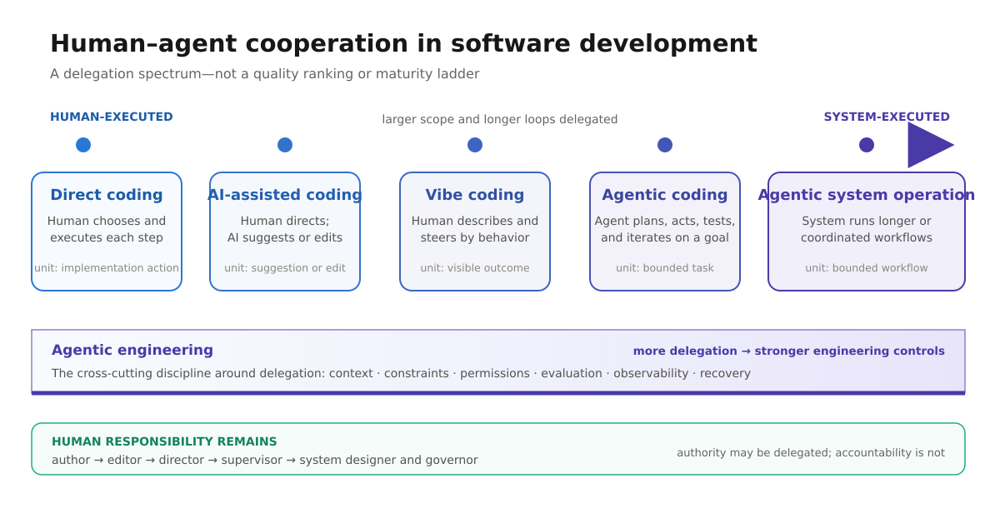

# The Human–Agent Cooperation Spectrum in Software Development

> **Status:** research synthesis  
> **Purpose:** establish a shared vocabulary for discussing how software work
> moves from direct human execution toward delegated agent execution. This is a
> conceptual model, not an industry-standard classification or a maturity ladder.



## Executive summary

AI changes software development by changing **who performs each action**, not by
removing human responsibility. At one end of the spectrum, a person directly
writes and verifies most of the implementation. At the other, an agent can plan,
use tools, modify a codebase, run checks, and recover from failures across a
longer work loop.

The useful question is therefore not “Are we using AI?” but:

> How much execution authority has the human delegated, over what scope, with
> what evidence, constraints, and opportunities to intervene?

The five modes below are recognizable patterns, but real work moves between
them. A team may use direct coding for a security-critical migration, AI
assistance for a refactor, vibe coding for a disposable prototype, and an agent
for a well-specified feature—all in the same project.

One important correction to the simple line: **agentic engineering is not merely
the most autonomous form of coding**. It is the engineering discipline required
to make delegated work dependable. Its importance grows as delegation grows.

## The spectrum

| Mode | Human primarily does | System primarily does | Typical control loop | Appropriate evidence |
| --- | --- | --- | --- | --- |
| **Direct coding** | Chooses the design and writes the implementation | Provides conventional tools; AI may be absent | edit → run → inspect | Human code review, tests |
| **AI-assisted coding** | Decomposes the task, selects changes, and integrates them | Suggests completions, snippets, explanations, or bounded edits | ask → inspect suggestion → accept or revise | Diff review, tests |
| **Vibe coding** | Describes the desired behavior and steers by observed results | Generates much of the implementation from natural language | describe → run → react | Visible behavior; often limited code inspection |
| **Agentic coding** | Defines the goal and constraints, approves consequential choices, validates the result | Plans, edits, invokes tools, tests, diagnoses, and iterates | delegate → agent loops → checkpoint → validate | Tests, logs, diffs, approvals |
| **Agentic system operation** | Designs policy, boundaries, escalation paths, and accountability | Executes and coordinates longer or recurring workflows, possibly through multiple agents | govern → observe → intervene by exception | Evaluations, traces, audit logs, policy checks, outcome monitoring |

The labels describe the **dominant interaction pattern**, not the quality of the
work or the seniority of the person using it.

## What changes from left to right

### 1. The unit of delegation grows

The human moves from delegating tokens or lines, to edits, to tasks, and finally
to bounded workflows. Longer delegation means the system makes more intermediate
decisions before returning control.

### 2. Control shifts from action to intent

On the left, the human specifies implementation steps. Moving right, the human
increasingly specifies outcomes, constraints, and acceptance criteria. This is a
change in abstraction, not the disappearance of engineering.

### 3. Feedback moves from continuous inspection to checkpoints

Direct coding exposes every decision as it is made. Agentic work compresses many
decisions into a result, diff, trace, or approval request. The quality of those
checkpoints determines whether the human can remain meaningfully in control.

### 4. The cost of a mistaken assumption increases

An incorrect completion is usually local. An incorrect goal interpretation can
propagate through many files, tools, or downstream actions. Greater autonomy
therefore calls for stronger boundaries and earlier escalation when intent is
ambiguous.

### 5. Engineering work moves up a level

As the system performs more execution, the human spends more effort on problem
framing, environment design, context, permissions, evaluation, observability,
and recovery. Domain expertise becomes leverage rather than overhead.

## The modes in detail

### Direct coding

The developer retains both decision authority and execution. They translate
requirements into architecture, implementation, and tests using conventional
development tools. This mode remains useful wherever the work is novel,
high-risk, tightly coupled to tacit knowledge, or faster to express directly
than to delegate.

### AI-assisted coding

AI contributes within a human-directed workflow: completion, explanation,
transformation, search, test generation, or a bounded change. The developer
still owns decomposition and usually examines each proposed change before it
enters the codebase.

The distinguishing feature is not the size of the generated patch. It is the
short leash: the human selects the next action and integrates the result.

### Vibe coding

The person primarily communicates desired behavior in natural language and
steers through rapid feedback. They may accept generated implementation without
understanding or reviewing it in detail. This makes the mode effective for
exploration, learning, and disposable or low-consequence prototypes.

“Vibe coding” should not be used as a synonym for all AI-assisted development.
The defining trait is intentionally loose engagement with the code itself. When
the result must be maintained, secured, or trusted, behavioral feedback alone is
not enough; the work needs explicit verification and engineering ownership.

### Agentic coding

The system operates a tool-using loop: it interprets a goal, forms or updates a
plan, edits files, runs commands and tests, observes results, diagnoses failures,
and iterates. The person supervises at task boundaries or checkpoints rather
than directing each edit.

Agentic coding is compatible with close human oversight. Autonomy concerns how
many intermediate actions the system can take and how independently it chooses
them—not whether a human is absent.

### Agentic system operation

Delegation extends beyond a single coding task into longer-running, recurring,
or coordinated workflows. A system may route work among specialized agents,
maintain state, use external services, and escalate only selected decisions.

At this point, reliability depends less on a clever prompt and more on the
surrounding operating system: permissions, durable state, evaluation, tracing,
approval gates, failure containment, and recovery.

## Agentic engineering: the discipline around delegation

Agentic engineering is best treated as a **cross-cutting discipline**, not the
rightmost point on the autonomy axis. It is the deliberate design of an
environment in which agents can perform useful work under explicit constraints
and produce evidence that humans can evaluate.

It includes:

- clear goals, requirements, non-goals, and acceptance criteria;
- context and knowledge with defined sources of truth;
- tools and permissions limited to the task;
- checkpoints and approval gates proportional to consequence;
- automated tests, evaluations, and outcome checks;
- observable actions through diffs, traces, logs, and artifacts;
- recovery paths for partial work, failure, and interruption;
- explicit ownership: the human or organization remains accountable.

This explains the apparent paradox: as direct human execution decreases, the
need for engineering expertise often increases. Expertise moves from typing
every action to designing and validating the conditions under which actions are
delegated.

## A better way to locate a workflow

A single label hides important differences. Evaluate a workflow on these six
dimensions instead:

| Dimension | Low delegation | High delegation |
| --- | --- | --- |
| **Scope** | completion or local edit | feature, phase, or recurring workflow |
| **Duration** | one response | long-running or resumable loop |
| **Decision authority** | human selects each action | system selects intermediate actions |
| **Tool authority** | read/suggest | write, execute, communicate, or deploy |
| **Human checkpoints** | continuous inspection | milestone or exception-based review |
| **Coordination** | one assistant | orchestrated agents or services |

Autonomy is also **task-relative**. The same agent may be highly autonomous when
renaming a well-tested API and tightly supervised when changing access control.

## Human responsibility does not move off the diagram

The spectrum shows who executes the work. It does not transfer accountability.
The human role evolves:

```text
author → editor → director → supervisor → system designer and governor
```

This is why “human in the loop” is too vague by itself. A meaningful description
states:

- what the human can see;
- when the system must stop;
- which actions require approval;
- what evidence the human reviews; and
- who owns the outcome.

## Implications for teams

- Use the least delegation that produces a clear advantage for the task.
- Increase verification and observability as scope, irreversibility, and impact
  increase.
- Treat natural-language intent as an input that still needs testable acceptance
  criteria.
- Preserve human understanding at the architectural and product-decision level,
  even when the agent authors most of the code.
- Design escalation as a normal path, not as agent failure.
- Judge the workflow by outcomes and evidence, not by the volume of generated
  code or the number of agents involved.

## Boundaries of this model

- The modes overlap; they are not formal standards.
- The spectrum is not a quality ranking. Direct work can be poor and delegated
  work can be rigorous.
- More autonomy is not automatically progress. The useful level depends on task
  clarity, risk, reversibility, and available verification.
- “Multi-agent” describes topology, not maturity. Several agents can still be
  tightly controlled, while one agent can have broad autonomy.
- Coding autonomy and deployment autonomy are different. An agent allowed to
  edit a branch is not necessarily allowed to merge, deploy, spend money, or
  communicate externally.

## Slide-ready takeaway

> Software development is moving from direct human execution toward bounded
> delegation. The human role evolves from author to governor, while agentic
> engineering supplies the constraints, evidence, and recovery mechanisms that
> make greater delegation trustworthy.

For a presentation, use the SVG above as the primary visual and link the slide
to this note for definitions, caveats, and the evaluation dimensions.

## Applying the model to a project

To place a real workflow on the spectrum, inspect what it enables rather than
what it calls itself:

1. Map each workflow phase to the six dimensions above.
2. Identify the artifacts that let a human understand and validate delegated
   work.
3. Mark actions that are intentionally prohibited or require approval.
4. Separate implemented mechanisms from documented aspirations.
5. Report coverage by phase; do not force the whole project into one point.

This produces a coverage profile—for example, highly delegated implementation
with strongly human-led planning—rather than a misleading single score.

## Sources and further reading

- Andrej Karpathy introduced “vibe coding” in February 2025 as a deliberately
  loose mode in which the user can largely ignore the code. The original post
  is linked and transcribed in [The original “vibe coding” note](https://oslovibecoding.tech/resources/the-original-vibe-coding-note).
- Anthropic describes an agent as operating a self-directed loop that plans,
  acts, observes, adjusts, and checks in when needed in
  [Trustworthy agents in practice](https://www.anthropic.com/research/trustworthy-agents).
- Anthropic treats autonomy as a degree of independence from human direction and
  oversight, and reports how safeguards and human involvement appear in real
  tool use in [Measuring AI agent autonomy in practice](https://www.anthropic.com/research/measuring-agent-autonomy).
- OpenAI discusses guardrails and human intervention as core parts of reliable
  agent deployment in [A practical guide to building agents](https://openai.com/business/guides-and-resources/a-practical-guide-to-building-ai-agents/).

