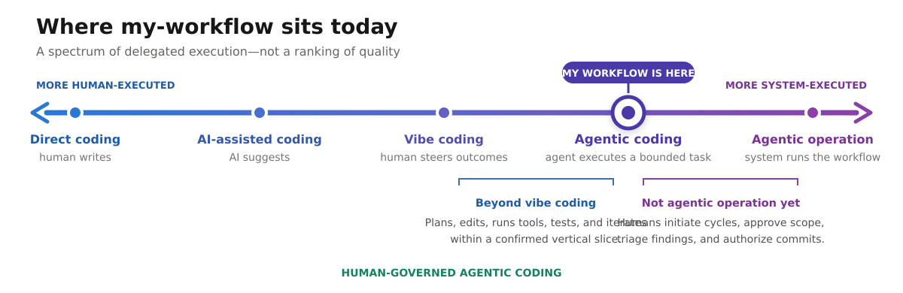

# Slide source: Human-governed agentic coding

> **Visual:** [Project coverage SVG](assets/diag-my-workflow-cooperation-coverage.svg)  
> **Definitions and model:** [Human–agent cooperation spectrum](research/human-agent-cooperation-spectrum.md)

## Slide

### Where `my-workflow` sits: human-governed agentic coding

> Agents execute bounded development loops. Humans govern their goals,
> boundaries, consequential decisions, and progression.

| Agents execute | Humans govern | The system does not |
| --- | --- | --- |
| Inspect, plan, edit, test, document, and review within a confirmed slice | Set direction, confirm slices, change scope, triage findings, and authorize Git actions | Schedule work, coordinate agents, enforce permissions, or operate unattended |

**Position:** agentic coding, not agentic system operation.

**Strength:** durable context, small slices, explicit checkpoints, review
evidence, and recovery artifacts.

## Speaker notes

This is a spectrum of delegated execution, not a quality ranking or maturity
ladder. Different phases occupy different positions: planning is strongly
human-led, bounded implementation and review are agentic, and Git or deployment
actions remain direct or AI-assisted.

`my-workflow` is beyond vibe coding because the agent operates a tool-using
loop against durable requirements: it plans, edits, runs checks, diagnoses
failures, and iterates inside a confirmed vertical slice. Tests, diffs, state,
and review findings make the work inspectable.

It stops short of agentic system operation because people still start sessions,
select cycles, coordinate providers, triage findings, and authorize commits.
There is no persistent scheduler, automatic multi-agent runtime, enforceable
permission policy, shared evaluation harness, or deployment governance.

The most accurate summary is:

> Agentic execution inside human-controlled cycles, supported by an emerging
> agentic-engineering discipline.

Agentic engineering is a cross-cutting discipline, not a final point on the
spectrum. The linked research note owns that distinction, the mode definitions,
the evaluation dimensions, and the model's caveats.

## Assessment basis

The position reflects current behavior, weighted in this order:

1. installer and hook behavior;
2. active skill contracts and `AGENTS.md` routing;
3. current workflow and problem documentation;
4. archived material only as historical context.

The clearest project evidence is:

- `next-slice`: one confirmed, independently verifiable slice per cycle;
- `plan-review`, `cross-review`, and `review-triage`: evidence-producing review
  with human-mediated decisions;
- `session-open`, `session-close`, and the state files: resumable work without
  unattended continuation;
- `hooks/context-zone.sh`: an automatic but advisory runtime guard;
- `WORKFLOW.md`: explicit human control of commits, pushes, and experimental
  parallel work.

Most safeguards are instruction-enforced rather than runtime-enforced. That is
the main boundary between the workflow's current rigor and a governed agent
operating platform.
